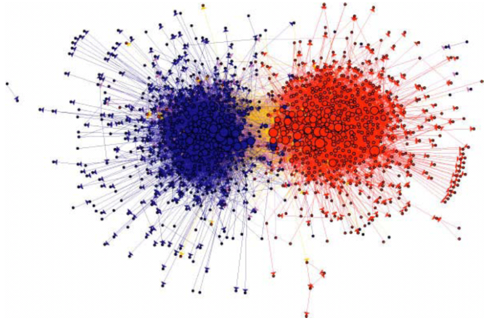
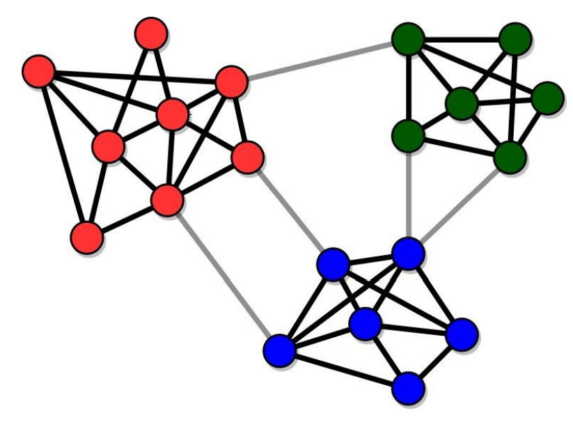

```{r setup, include = FALSE}
library(learnr)
library(gradethis)
# library(magrittr)
tutorial_options(exercise.checker = gradethis::grade_learnr)
knitr::opts_chunk$set(echo = TRUE)


# Check whether required packages are installed
pkgs <- matrix(c(
  "gradethis", "0.2.3.9001", "rstudio/gradethis",
  "fontawesome", "0.2.2", "CRAN",
  "igraph", "1.2.6", "CRAN",
  "igraphdata", "1.0.0", "CRAN",
  "intergraph", "2.0-2", "CRAN",
  "network", "1.17.1", "CRAN",
  # "networkD3", "0.4", "CRAN",
  "sna", "2.6", "CRAN",
  "SNA4DSData", "0.9.9000", "SNAnalyst/SNA4DSData"
), byrow = TRUE, ncol = 3) |> 
  as.data.frame() |> 
  setNames(c("pkg", "version", "where"))

check_pkgs <- function(.pkgs = pkgs) {
  SNA4DS:::check_packages(.pkgs)
}

# RStudio, at least 4.1717
check_RStudio <- function(x = 4.1717) {
  SNA4DS:::check_rstudio(x)
}


# R check version (required 4.1.1)
check_R <- function(x) {
  SNA4DS:::check_r_equal(4, 1.1)
}

```

```{css, echo = FALSE}
.red {
  color: #FF0000;
}

.emphasized {
  font-size: 1.2em;
  color: #FF6000;
}
```


## Introduction

So far, you learned the basics of R and were introduced to some first work 
with network data.

In this tutorial, you are going to learn how to compute a bunch of statistics 
at the graph level and manipulate network objects a bit.

Moreover, you'll learn how to find and extract subgroups from a network.

Pretty cool stuff!

<br><br><br>

```{r, fig.align='center', echo = FALSE}
knitr::include_graphics("images/cool_small.jpg")
```

<br><br><br>
Yep, that's what I said `r fontawesome::fa("far fa-smile-beam", fill = "blue")`<br>
Let's get to it.


## Checking installation

Yeah, just to make sure, let's quickly  make sure you have all of the required packages installed. .

### R Version 

You need to have installed R version 4.1.1 and this tutorial is going to check it
for you. Please hit the `Run Code` button.

```{r r_check, echo = TRUE, include = TRUE, exercise = TRUE}
check_R()
```


### R Studio Version

You need to have installed RStudio version 1.4.1717 or above.
Let's check by clicking `Run Code`:

```{r rstudio_check, echo = TRUE, include = TRUE, exercise = TRUE}
check_RStudio()
```


### Packages

You need to have a few packages installed. 
Click the `Run Code` to check. 
It will check whether you have the required packages installed and will 
attempt to install any missing packages in case there are any (or it will 
advise you to upgrade `SNA4DS`).

```{r package_check, echo = TRUE, include = TRUE, exercise = TRUE}
check_pkgs()
```


## Summary statistics of networks
You are, no doubt, familiar with the concept of the ["_five number
summary_"](https://en.wikipedia.org/wiki/Five-number_summary). When you start
working with **any** dataset, it is advisable to **always** start with some
basic descriptives to start to get a feeling for the dataset. The Five number
summary is a common starting point.

When I get new dataset, I always make such summaries (usually a bit more
extensive than these five basic numbers) and do some exploratory plotting.

You should do the same with any network dataset.

Once you have your network in an object that is ready for analysis, always start
with an initial exploration of the data, so you get a feel for what you are
dealing with. Let's look at some of the things you would do.

### print the object

This is something you are now used to. Print it, using the print method of the
package you are using for your analysis, and check whether the network is
directed/undirected, weighted/unweighted, how many vertices and edges there are,
and which attributes there are.

Do that here.
Load the `enwiki` network that is included in the `SNA4DSData` package. 
Then print it. This can take a couple of seconds on your machine.

```{r load_enwiki, include = FALSE}
enwiki <- SNA4DSData::enwiki
```


```{r grade_summary1, exercise = TRUE}
data('enwiki', package = "SNA4DSData")
igraph::print.igraph(enwiki)

```

### Average path length

The average path length is calculated with `igraph::mean_distance`. Go ahead and
calculate it below. It may take a few seconds to run on your laptop.

```{r grade_summary3, exercise = TRUE, exercise.setup = "load_enwiki"}
cat('calculate the average path length of the enwiki network')
```

```{r grade_summary3-solution}
igraph::mean_distance(enwiki)

```

```{r grade_summary3-check}
gradethis::grade_code(correct = "That's how it is done!")
```

Hmmm, why does this take so long to run? <br>
Well, consider what this is doing. 
The algorithm needs to find the shortest possible path from any vertex to any other 
vertex and then take the mean of those. 
That's a lot of work, because there are a lot of pairs of vertices. <br>
Can you figure out how many pairs of vertices exist in this graph?

```{r number-of-pairs, echo=FALSE}
question("How many pairs of actors are there in the `enwiki` network?",
  answer("15220", message = "No, this is the number of vertices, not the number of pairs in the graph."),
  answer("30440"),
  answer("194103", message = "An understandeable mistake, but this is the number of edges that are active, not the total number of pairs in the graph."),
  answer("388206"),
  answer("231633180", correct = TRUE, message = "Brilliant! Did you solve it straight away?"),
  answer("231648400", message = "Close! But make sure not to count paths from a vertex to itself"),
  answer("2954247660"),
  allow_retry = TRUE
)
```

### Diameter

From the *average path length* to the *diameter* of a graph is just a small step.
The diameter is the largest shortest path in the network.

It is easy to calculate. Let's see if you can find the appropriate function in 
the `igraph` package to calculate the diameter of the `enwiki` network. 

I think you are started to find that finding the right function becomes easier every time!

(do make sure to check the help file for the `diameter` function)

As you learnt from the previous exercise, this may take a few seconds on your machine.

```{r diameter, exercise = TRUE, exercise.setup = "load_enwiki"}
cat('calculate the diameter of the enwiki network')
```

```{r diameter-solution}
igraph::diameter(enwiki)

```

```{r diameter-check}
gradethis::grade_code(correct = "That's how it is done!")
```

OK, so you found the diameter. Can you interpret it? Do you consider it high 
or low (or in between)?

Let's look at the diameter one more time. 
In the box below, we will create a network and calculate the diameter on it. 
This is the network from Figure 2.5 in the Easly & Kleinberg book.<br>
Can you understand where the numbers come from?
Make sure to check out the help for the functions.
Feel free to play around with the network and the code. Go crazy!

```{r diameter2, echo = TRUE, include = TRUE, exercise = TRUE, exercise.lines = 26}
edges <- matrix(
  c("A", "B",
    "C", "E",
    "D", "E",
    "F", "G",
    "F", "H",
    "G", "J",
    "G", "I",
    "J", "H",
    "I", "K",
    "J", "K",
    "K", "L",
    "H", "L",
    "H", "M",
    "L", "M"
  ), ncol = 2, byrow = TRUE
)

fig25 <- igraph::graph_from_data_frame(edges, directed = FALSE)
plot(fig25)

igraph::diameter(fig25)
igraph::get_diameter(fig25)
igraph::farthest_vertices(fig25)

igraph::diameter(fig25, unconnected = FALSE)
```


### Dyad census

Now, look at how many ties are reciprocated. Reciprocated ties are ties that run
both from vertex _i_ to _j_ **_and_** from _j_ to _i_. These are also called
_mutual ties_. When an edge runs in one direction, and is not reciprocated, it
is often called _asymmetric_. When an edge does not occur between two vertices,
this is denoted a _null_.

You calculate this with the function `igraph::dyad.census` as follows:

```{r dyadcensus, echo = TRUE, include = TRUE, exercise = TRUE, exercise.setup = "load_enwiki"}
igraph::dyad.census(enwiki)
```

With these numbers, you should be able to calculate the reciprocity of the 
graph by hand.
It is a number between 0 and 1: 0 means that not a single dyad has mutual ties.
In this case, there are no M's, but there are A's.<br>
Reciprocity of 1 means that all dyads in which there is at least 1 tie also 
have a second tie (going the other direction). In other words: there are no 
A's, but there are M's. <br><br>
For reciprocity, N's do not matter. 
All we want to know is what proportion of dyads that have at least 1 tie also 
have a second one.

So, use the result from the dyad.census above to manually calculate the reciprocity. 
Then check your result using the `igraph::reciprocity` function.
(the numbers are allowed to differ in the third decimal or so, because the actual 
function that `igraph` uses is *slightly* different, but very close.)


```{r recip, echo = TRUE, include = TRUE, exercise = TRUE, exercise.setup = "load_enwiki", exercise.lines = 4}
## calculate reciprocity manually

## now compare with igraph's reciprocity function

```

```{r recip-solution}
40257/(40257 + 113589/2)
igraph::reciprocity(enwiki)

```

```{r recip-check}
gradethis::grade_code(correct = "That's how it is done!")
```


### transitivity

> The friends of my friends are my friends.

I am sure that you have heard this before. Or: 

> The enemy of my friend is my enemy. 

These statements no longer are about dyads, but about _triads_ instead. A triad
consists of a set of three vertices and the edges between them. In a directed
graph, every triplet of vertices can be in any of 16 states, varying from an
empty triad (where there are no edges between the three vertices), a direct line
(A->B->C), an outstar (A<-B->C), et cetera, all the way to the complete graph
(A<->B<->C, A<->C).

If you are interested, you can look at `?igraph::triad.census` to see what all
16 states look like. But we will come back to these 16 types extensively 
when we get into Exponential Random Graph Models later in this course.

For today, all we are interested in is _transitivity_. Transitivity considers
the situation in which A is friends with B and A is friends with C and
calculates the probability that B and C are also friends. This is an important
form of _closure_: the extent to which the people that you are friends with are
also friends with each other.

Of course, this is not limited to friendship, but is a measure that is useful
for many types of relationships, including directed ones.

You calculate transitivity through the function, believe it or not,
`igraph::transitivity`. But beware that you need to be specific as to whether
you want to use directed or undirected ties, whether you want the transitivity
score that involves a specific vertex or you want an overall score for the
network as a whole. Type `?igraph::transitivity` to check out the help page for
the options.

For our summary purpose, I am really only interested in the global measure.
Local scores are often also very useful, but that is something you look at if
the analysis asks for it, not as part of a "five number summary" activity.

Determine that overall measure now.

```{r grade_summary5, exercise = TRUE, exercise.setup = "load_enwiki"}
cat('calculate the global transitivity of the enwiki network')
```

```{r grade_summary5-solution}
igraph::transitivity(enwiki, type = "global")
```

```{r grade_summary5-check}
gradethis::grade_code(correct = "You've got this thing down!")
```

Mmm, how do you interpret this value? Are you surprised by it?


### Network density

A very common measure of any network is its *density*. 
A network's density is the proportion of all possible edges that are 
actually present in the network. 
An empty network has density 0. 
A network where everybody is directly connected with everybody else has density 1. 
A network where only have of the possible ties are active has density 0.5. 
You get the idea.

You should be able to calculate this measure manually. 
After all, you already figured out how many edges are possible in the network 
(you calculated this in a previous exercise) and you already noticed how many 
edges are actually there.

Below, first manually calculate the density of the `enwiki` network and then
compare your results with what `igraph` thinks it is--use `igraph::edge_density` for this.


```{r grade_summary2, exercise = TRUE, exercise.setup = "load_enwiki", exercise.lines = 4}
# Below, calculate the density of the enwiki network

# Below, compare with the result from igraph itself

```

```{r grade_summary2-solution}
194103/(15220*15219)
igraph::edge_density(enwiki)
```


That is very low, but this is to be expected for this network.<br>
(in a few weeks you'll learn how to statistically test whether this value is 
indeed low or only looks like it.)


### Let's summarize

You learned about a set of statistics that summarize some of the basic
characteristics of a network. Make a habit to always calculate these. If you
want, you can even write a single function that does all of this for you. Or a
script. Next week, we'll add some more measures.

These are the statistics we have covered:

What you look for in the printout of the object:

* graph characteristics: Directed or Undirected, Weighted or Unweighted,
bipartite/unipartite

* the number of vertices

* the number of edges

* which attributes do we have for the vertices?

* which attributes do we have for the edges?

Separate calculations:

* network density

* average path length

* diameter

* average degree

* degree census

* global transitivity

We already did **a LOT**!

Of course, we should also look at the descriptives of the attributes of the
vertices and edges. One way to do this for the edges is as follows. Let's
consider the `enron` network, because that dataset contains edge attributes.

```{r edge_attr_summary, include = TRUE, exercise = TRUE}
data(enron, package = "igraphdata")
igraph::list.edge.attributes(enron) %>% 
  sapply(function(z) summary(igraph::get.edge.attribute(enron, z)))
```

You can do this for the vertices as well. In this case, that isn't very
interesting, because the vertex attributes are only character variables such as
name and e-mail address.

Anyway, take a good oook at the code you just used, because it will teach you 
the useful `igraph::list.edge.attributes` function and you get to use the 
`sapply` function you learnt about in the first tutorial. <br>
If this code isn't fully clear to you, make sure to ask us in class!

## Subgroups

In the first lecture, we already saw this network picture of political blogs 
on the internet.



(source: Lada A. Adamic and Natalie Glance, "The
political blogosphere and the 2004 US Election", in Proceedings of the
WWW-2005 Workshop on the Weblogging Ecosystem (2005).)

The red blogs support the Republican party and the blue blogs support the Democrats. 
The edges represent blogs that link to each other. <br>
What do you think, does this political landscape look well-mixed and integrated? 

Not exactly, the network clearly falls apart into two subgroups that are each pretty 
cohesive inside, but with relatively few edges between the groups.

Let's see how we can detect subgroups/communities using `igraph`.

### Basics

First, we need a few definitions.

- The *internal degree* of a node is the number of others nodes a node is connected to inside its community

- The *external degree* of a node is the number of others nodes a node is connected to outside of its community

- The *community degree*: the sum of degrees of the nodes that are a member of the community

- The *internal link density*: the ratio between the number of edges that exist in a community and the maximum possible number of edges inside that community

For a good community, we want two main features:
- High cohesion: communities have many internal links, so their nodes stick together
- High separation: communities are connected to each other by few links



- Strong community: subnetwork such that the internal degree of each node is greater than its external degree 
- Weak community: subnetwork such that the sum of the internal degrees of its nodes is greater than the sum of their external degrees

### Finding communities

There are dozens of ways in which one can find communities that fulfill these requirements. 
We will consider three algorithms that are implemented in `igraph`.

#### Girvan-Newman
The Girvan-Newman algorithm uses edge betweenness (a topic that will be discussed next week).
What the algorithm does is to calculate the betweenness of all of the edges, 
remove an edge from the network with the highest betweenness, calculate the betweenness of all of the edges, 
remove an edge from the network with the highest betweenness, et cetera.
The basic idea is that removing those edges that link groups together should lead 
to the detection of communities that are cohesive inside.

Anyway, this is implemented in `igraph::cluster_edge_betweenness()`. 
When you run this, you get 

- the number of communities
- the labels of which community each node is assigned to
- the modularity

This *modularity* is the difference between the number of internal links in 
the community and the expected value of this number in the 
set of randomized networks used as baseline.<br>
Why compare with randomized networks? 
Because randomized networks have no communities!

A low modularity means that the community structure is much like that of a 
randomized graph. In contrast, if the number of edges within the communities 
is much larger than its expected random value, it is unlikely for such a concentration 
of edges to be the result of a random process, and the modularity will be high.

The bottom line? The higher the modularity, the better the partitioning into communities.

Often, researchers will use multiple community detection algorithms and pick the 
one with the highest modularity, an approach known as *modularity optimization*.

This algorithm is meant for *undirected* graphs, so you may get a warning 
if you use it on directed graphs.

We are going to work with the `discuss` network. 
This is a network of politicians and measures who goes to whom to discuss 
current political matters. 
The politicians in this network belong to four different political streams and are 
colored as such.


```{r load_discuss, include = FALSE}
discuss <- SNA4DS:::discuss
discuss <- igraph::as.undirected(discuss)
```

```{r explore, include = TRUE, exercise = TRUE, exercise.setup = "load_discuss"}
igraph::print.igraph(discuss)

plot(discuss)
```

Now, try the Girvan-Newman algorithm and see if you find some good communities.

```{r girvan, include = TRUE, exercise = TRUE, warning = FALSE, exercise.setup = "load_discuss"}
girvan <- igraph::cluster_edge_betweenness(discuss)

# check the modularity
igraph::modularity(girvan)

# check which community each vertex belongs to
igraph::membership(girvan)

plot(girvan, discuss)
```

How many communities did you find? Do they make sense?

#### Louvain

The Louvain algorithm is quite complicated internally. 
But the essence is that it begins with assigning each vertex to its own community 
and then moves nodes to join other communities, based on which move would increase 
the modularity the most. 
In theory, I say: *in theory*, this should give us communities with excellent modularity.

Oh, and this algorithm is meant for *undirected* graphs, so you may get a warning 
if you use it on directed graphs.

Let's try it out. 

```{r louvain, include = TRUE, exercise = TRUE, warning = FALSE, exercise.setup = "load_discuss"}
louvain <- igraph::cluster_louvain(discuss)

# check the modularity
igraph::modularity(louvain)

# check which community each vertex belongs to
igraph::membership(louvain)

plot(louvain, discuss)
```

Any better? Do you see the differences in which nodes are assigned together?<br>
In this case, we are working from a network that is quite clearly segmented already, 
so all algorithms should give decent results here.

#### Walktrap

My personal favorite. Why? 
Because it follows a cool idea that makes such intuitive sense.


Imagine you are dropped somewhere on the network. 
You have no clue what the network looks like, so you start walking and walking. 
Everytime you come to a vertex, you write down the name of that vertex on a 
piece of paper. 
Then you continue walking by randomly picking one of edges that lead away from this vertex.<br>
Oh, and you always adhere to the directions: in a directed network, only walk 
across edges in the direction they are pointing. 
In an undirected network, you can walk in any direction across the edges.
I a weighted network, the probability of choosing a specific edge is proportional 
to its weight: the higher the weight, the larger the probability of picking that
edge to continue you walk on.

All of your choices of which edges to walk are completely random, but you never 
jump to a different place in the network, you always continue walking from 
where you are. 

After having walked around like this for some time, you may start to notice that 
you are constantly going through the same set of vertices. 

Having walked around for awhile, you are removed from the network and again 
dropped on top of it at a random vertex. And you start walking again and making 
notes of which vertices you cross. You do this in a fresh list, each time.

Anyway, after having made a lot of such random walks across the network, you will 
start to notice that a certain group of nodes tend to co-occur within walks and 
another group of nodes also co-occur, et cetera. These are the communities.

Compare it to people telling each other a secret. 
Imaging that you tend to share your secrets with Jenny and Jenny tends to 
tell her secrets to Peter and Ezra. Ezra and Peter tend to share their secrets 
with you. 
Then, this process will lead to your secret reaching you again. 
If this happens a lot, the four of you are a community. 

A walktrap community is especially useful to measure how information travels 
through a network: the more and the stronger the communities, the more information 
tends to get "trapped" inside subgroups within the network. 

Now you understand the name of the algorithm.

Long story short, you run `igraph::walktrap.community`. 
The `steps` argument specifies the length of each random walk.

```{r walktrap, include = TRUE, exercise = TRUE, warning = FALSE, exercise.setup = "load_discuss"}
walktrap <- igraph::walktrap.community(discuss)

# check the modularity
igraph::modularity(walktrap)

# check which community each vertex belongs to
igraph::membership(walktrap)

plot(walktrap, discuss)
```

This is a different kind of approach to finding subgroups. A more intuitive one. 
As you can see, it gives slightly different results. 
Does it make sense to you?<br>

#### Alternatives
There are many other ways to find communities. 

**Greedy optimization** works well for large networks. 
It starts with each vertex as a separate community and tries to merge existing 
communities such that modularity increase at each step is as large as possible.
You use: `igraph::fastgreedy.community(network)`.

**Spinglass** is an algorithm for directed weighted networks. 
Believe it or not, the function is called `igraph::spinglass.community(network)`.


## Let's close for today

That's it for this tutorial. 

I hope you had fun. I certainly did when putting this together for you.

It may seem like a lot, but you will get the hang of it quite soon. 
And don't forget we have a very useful vignette inside `SNA4DS` that gives 
you an overview of the functions you need to know. 
You can use that during the exam as well, no need to memorize all of the 
function names by heart.

Just enter

```r
SNA4DS::open_SNA4DS_vignettes()
```

inside RStudio and pick the *SNA coding cheatsheet* from the popup.

For now, relax and enjoy that you are on your way 
to becoming a true network scientist.

We'll meet again in the next tutorial, where we will focus on node level metrics.
Just one more week! Until then.


