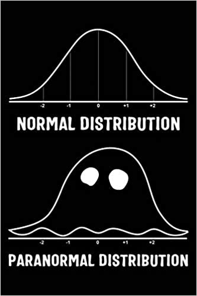
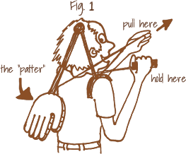

```{r setup, include=FALSE}
library(learnr)
library(gradethis)

knitr::opts_chunk$set(
	echo = FALSE,
	message = FALSE,
	warning = FALSE,
	cache = FALSE
)

source("../R/helper_code.R")

# Check whether required packages are installed
pkgs <- matrix(c(
  "learnr", "0.10.0", "CRAN",
  "gradethis", "0.2.3.9001", "rstudio/gradethis",
  "igraph", "1.2.6", "CRAN",
  "knitr", "1.34", "CRAN",
  "sna", "2.6", "CRAN",
  "SNA4DSData", "0.9.904", "SNAnalyst/SNA4DSData",
  "ergm", "4.1.2", "CRAN",
  "network","1.17.1" , "CRAN",
  "texreg", "1.37.5" , "CRAN"
), byrow = TRUE, ncol = 3) |> 
  as.data.frame() |> 
  setNames(c("pkg", "version", "where"))

check_pkgs <- function(.pkgs = pkgs) {
  SNA4DS:::check_packages(.pkgs)
}

# RStudio, at least 4.1717
check_RStudio <- SNA4DS:::check_rstudio


# R check version (required 4.1.1)
check_R <- function(x) {
  SNA4DS:::check_r_equal(4, 1.1)
}
```


```{css, echo = FALSE}
.tip {
  border-radius: 10px;
  padding: 10px;
  border: 2px solid #136CB9;
  background-color: #136CB9;
  background-color: rgba(19, 108, 185, 0.1);
  color: #2C5577;
}

.warning {
  border-radius: 10px;
  padding: 10px;
  border: 2px solid #f3e2c4;
  background-color: #f3e2c4;
  background-color: rgba(243, 226, 196, 0.1);
  color: #775418;
}

.infobox {
  border-radius: 10px;
  padding: 10px;
  border: 2px solid #868e96;
  background-color: #868e96;
  background-color: rgba(134, 142, 150, 0.1);
  color: #2F4F4F;
}

# # create a horizontal scroll bar when code is too wide
# pre, code {white-space:pre !important; overflow-x:auto}
```

```{html, echo = FALSE}
<style>
pre {
  white-space: pre-wrap;
  background: #F5F5F5;
  max-width: 100%;
  overflow-x: auto;
}
</style>
```

## Introduction

Welcome to the second tutorial on Exponential Random Graph Models (ERGMs).

In the first ERGM tutorial you learned

* How to run an ERGM with the structural term `edges`, comparing it to an
Erdos Renyi model
* How to simulate networks from a specified model
* How to specify a P1 model using the dyadic independent terms `edges` 
`sender`, `receiver`, and the dyadic dependent term `mutual`
* How to search for terms with the function `ergm::search.ergmTerms`
* How to use and interpret the nodal attribute terms `nodecov` and `absdiff`

In this tutorial we build on this, improve our understanding of ERG models and learn how to check whether the model we run has a good fit.

Let's add a new tier to our ERGM knowledge!

{width=75%}


## Ingredients check!

Before we start to bake the new tier, we need to make sure we have the ingredients for our recipe ready!


### R Version 

You need to have installed R version 4.1.1 and this tutorial is going to check it
for you. Please hit the `Run Code` button.

```{r r_check, echo = TRUE, include = TRUE, exercise = TRUE}
check_R()
```


### R Studio Version

You need to have installed RStudio version 2021.9.0.351 or above.
Let's check by clicking `Run Code`:

```{r rstudio_check, echo = TRUE, include = TRUE, exercise = TRUE}
check_RStudio()
```


### Packages

You need to have a few packages installed. 
Click the `Run Code` to check. 
It will check whether you have the required packages installed and will 
attempt to install any missing packages in case there are any (or it will 
advise you to upgrade `SNA4DS`).

```{r package_check, echo = TRUE, include = TRUE, exercise = TRUE}

check_pkgs()

```


Turn on the oven, we are ready for some mouth watering bun to cook!


## A dyadic independent model

In the first ERGM tutorial, we run very simple models on very small networks. 
However, very often, networks are larger than the Florentine or Sampson's ones and the relationships they map down require more sophisticated efforts to be 
explained.

Let's take a look at the `faux.mesa.high` data set, one of the networks
included in the `ergm` package and employed in the `statnet` tutorials. Remember,
`statnet` is the project that developed the `r` package `ergm`. Their tutorials are the first source of information if you are running ERGMs in `r`.

The `faux.mesa.high` is modified data collected at the Mesa High School in the US

{width=75%}


Go Rabbits! Carry On!

```{r load_mesa, include = FALSE}
data(faux.mesa.high, package = 'ergm')

mesa <- faux.mesa.high
```

Let's explore this network

```{r explore_mesa, exercise = TRUE, exercise.setup = "load_mesa"}
summary(mesa)
```

The mesa network contains information about 203 relationships among 205 students enrolled at the Mesa High School. Well, not quite. The real information about the students is classified, but we can look at something that is close enough. This way we can explore the network without revealing any sensitive data. 

We have three nodal attributes: 

* Student School Grade
* Student Race
* Student Sex

Let's visually examine the network and its attributes.

```{r plot_mesa, exercise = TRUE, exercise.setup = "load_mesa"}
table(network::get.vertex.attribute(mesa, "Grade"))
plot(mesa, vertex.col = 'Grade')
legend('bottomleft', fill = 7:12,
       legend=paste('Grade', 7:12), cex = 0.75)


```

Can you do the same for the attributes Race and Sex? (Tip: don't forget to pass the names of the categories to the `legend` argument!)

```{r grade_PlotMesa, exercise = TRUE, exercise.setup = "load_mesa"}


```


```{r grade_PlotMesa-solution}

table(network::get.vertex.attribute(mesa, "Race"))
plot(mesa, vertex.col = 'Race')
legend('bottomleft', fill = 1:5,
       legend = c('Black', 'Hisp', 'NatAm', 'Other', 'White'), cex = 0.75)

table(network::get.vertex.attribute(mesa, "Sex"))
plot(mesa, vertex.col = 'Sex')
legend('bottomleft', fill = 1:2,
       legend = c('F', 'M'), cex = 0.75)


```


```{r grade_PlotMesa-check}
gradethis::grade_code(correct = "Well Done!")
```

Wonderful! You just made plots using the `network` package! Did you notice that? Quite similar to `igraph` right? Well, I hope you enjoyed the experience. For the reminder of the course get back to `igraph` plotting! :)

Switching back to ERGMs... Carefully observe the nature of the relationships in the plots. 


Do Grade, Race, or Sex drive friendship? That's the research question we are going to answer using ERMGs!


After adding the term `edges` that is our intercept, what does come next? 

Let's focus on Grade. This nodal attribute is categorical. Hence we need to choose terms that can handle this typology of data. 

Since we want to know whether being in the same grade fosters friendship formation, we can use the term `nodematch`. This term handles categorical data and explores the existence of homophilic relationships among people who share the same category (grade in this case).

Another term that we can use with a categorical nodal attribute is`nodefactor`.
This term outputs one statistic for each category in the attribute minus one to avoid linear dependency. Each of these statistics gives the number of times a node with that attribute, and that category appears in an edge in the network.

Let's run a first exploratory round.

```{r mesaErgmGrade, exercise = TRUE, exercise.setup = "load_mesa"}
mesaM1 <- ergm::ergm(mesa ~ edges +
                     nodematch('Grade', diff = TRUE) +
                     nodefactor('Grade'))
summary(mesaM1)                     
```

Every statistic in the result's table allows us to reject the null hypothesis of no effects. The coefficients produced by the `nodematch` term inform us of the existence of homophilic effects in each grade. Grade 12 is the one where these effects are less likely to take place. 

The `nodefactor` term informs us of the probability that a certain grade characterizes nodes connected to other nodes. We can say that students in grade 12 are more likely to have friends than students in other grades. We interpret it just like we would interpret a categorical variable in a logistic regression!

What happens if we try to run the same exploratory model but focusing on race? Can you do it? Call the model 'mesaM2' and give it a go. Don't forget to print the summary; we are interested in the results!


```{r grade_ergmRace, exercise = TRUE, exercise.setup = "load_mesa"}


```

```{r grade_ergmRace-solution}

mesaM2 <- ergm::ergm(mesa ~ edges +
                       nodematch('Race', diff = TRUE) +
                       nodefactor('Race'))

summary(mesaM2)


```


```{r grade_ergmRace-check}
gradethis::grade_code(correct = "Well Done!")
```


The first thing that we see when checking the `mesaM2` result's table is that two of the `nodematch` coefficients are estimated at `-Inf`. Is there something wrong with the model? Let's check on its descriptive statistics. 

```{r mesaErgmRaceStats, exercise = TRUE, exercise.setup = "load_mesa"}
summary(mesa ~ edges +
          nodematch('Race', diff = TRUE) +
          nodefactor('Race'))
```

We can see that the two categories that produced the `-Inf` coefficients correspond to a 0 in the descriptive statistics table. Does it mean that we don't have any student of Race black and other in the school? 
Let's check the frequency of the nodal attribute to dig deeper.

```{r mesaErgmRaceFreq, exercise = TRUE, exercise.setup = "load_mesa"}
table(network::get.vertex.attribute(mesa, "Race"))
```

Nope! There are no empty categories in the variable. If there were empty categories we would have had `-Inf` in the `nodefactor` results rather than the `nodematch` results since that term checks on the likelihood of each of these categories forming friends. The zero corresponds to the homophilic cases measured by the term's formula. AKA: there are no homophilic effects for students of races `black` and other. Still, even if these two categories are not empty, they are less represented than the other. Hence, having a larger sample, we might have found effects for these two too.  


_In case one or more frequencies were empty_ we should have considered treating
this case as _missing data_ and discussed our option accordingly. However, this is NOT a missing data case. 

It's always crucial to check both the nodal attribute's frequency and the model specification's descriptive statistics. Only checking both we can have the full picture and avoid mistakes, such as treating this case as a missing data one. 

Since, we don't have homophilic effects for two categories, it would be better to specify `nodematch` with `diff = FALSE`

Let's move on and check what happens with the nodal attribute Sex, still considering the same specification.

```{r mesaErgmSex, exercise = TRUE, exercise.setup = "load_mesa"}
mesaM3 <- ergm::ergm(mesa ~ edges +
                       nodematch('Sex', diff = TRUE) +
                       nodefactor('Sex', levels = -(2)))

summary(mesaM3)

```

If you read the text outputed by the model, it says that it might be the case that 'the model is nonidentifiable.' This is a new error message introduced with `ergm 3.11`.
It indicates linear dependence between the results of these two terms. `nodematch` tells us whether there are homophilic effects due to sex, while `nodefactor` tells us what's the probability for female and male students to make friends. In this context, homophily is more interesting; hence since we need to get rid of one term to avoid linear dependence, let's discard `nodefactor`. 

’Please note that I used the levels argument in this exploratory model to tell the software to compute and print the statistic for the female category rather than the male one. That's how you change your model reference category. If you do change the reference category, obviously, your output will be different. The options for changing the reference category might be different from term to term, so you need to read the manual.

After running a few exploratory models, let's try to fit a comprehensive one. 
We can keep both terms for what concerns Grade. 

When it comes to Race the term looking for homophily shows two empty categories. What do we do?

The way we specified `nodematch` so far checks for _differential homophily_, that looks for homophily within each category. But it can also be specified to check overall homophily in the whole network.

For what concerns Race in the mesa school, since some categories are empty, but others are not, removing the term might seem a loss of information. We can then specify the more generic option that assesses whether there is homophily overall, not informing us about each category but providing one single statistic
for the all network. 

What concerns the Sex attribute, let's keep differential homophily and remove the `nodefactor` term.

Let's fit the model!

```{r mesaErgmOverall, exercise = TRUE, exercise.setup = "load_mesa"}

mesaM4 <- ergm::ergm(mesa ~ edges +
                       nodematch('Grade', diff = TRUE) +
                       nodefactor('Grade') +
                       nodematch('Race', diff = FALSE) +
                       nodefactor('Race') +
                       nodematch('Sex', diff = TRUE))

summary(mesaM4)
```


This looks like a pretty nice model! Let's comment on this model's overall meaning. 

* nodematch-grade (differential homophily): There is a homophilic effect due to grade. The strongest homophily is in grade 7 and the weakest in grade 12 (check the odds ratios!).

* nodefactor-grade: this term tell us the likelihood of students in each grade to make friends. Grade 12 students have the highest number of friends.

* nodematch-Race: there are homophily effects due to race

* nodefactor-race: White students are more likely to have friends than the other
categories

* nodematch-sex (differential homophiliy): There are homophilic effects among
female students, but not among males.

Quite informative for a simple model, right? What if I tell you that we can look at even more informative model configurations? 

So far, we explored only dyadic independent terms that look at the probability of relationship as a consequence of the nodes' properties. We looked at nodal attributes, or the simple node propensity to connect to others (`edges`, `sender`, `receiver`). 

We already know that there is more than this. 

With these dyadic independent model configurations, we cannot explore situations where you meet a new friend who was in school with your roommate. We cannot explore situations where you start to follow someone on Instagram just because all your other friends do, among other examples. 

These are all important things to explore, and that's why we need to use 
dyadic dependent terms too.


## Dyadic Dependent Terms

We just covered the conceptual difference between dyadic independence and dependence. To wrap this up: We have dyadic independence when the probability of edge formation is related to nodes properties or attributes; the second is related to the probability of other existing edges. 

In practice, you know when you are running a dyadic independent or dependent 
model by reading the information that the model prints for you while running.

```{r load_flob, include = FALSE}

 
florentine <- SNA4DSData::florentine
flo_bus <- florentine$flobusiness
flobusiness <- intergraph::asNetwork(flo_bus)

```

Let's run a dyadic independent

```{r flob_dyad_indep, exercise = TRUE, exercise.setup = "load_flob"}

fit <- ergm::ergm(flobusiness ~ edges)
summary(fit)

```

You cannot see it in the tutorial, but if you check on your Rstudio console you will see some text informing us that the results are estimated computing maximum pseudolikelihood estimation (MPLE). 

Let's check a dyadic dependent example to compare. We can simply add the dyadic
dependent term `degree` to the previous model. This specification checks on the probability that the number of nodes with degree one in the florentine business network is non-random. We care only about the output text now, though. Let's read on.

```{r flob_dyad_dep, exercise = TRUE, exercise.setup = "load_flob"}

fit <- ergm::ergm(flobusiness ~ edges + degree(1))
summary(fit)

```

This text (also in the console) tells us that results are computed using Monte Carlo Markov Chains (MCMC). What does it mean? 
Dyadic dependent models cannot be estimated as the dyadic independent ones. 
They are solved using Monte Carlo Markov Chains that stochastically approximate the Maximum Likelihood. 

This means that when you have dyadic dependent terms, your model is computationally more complex. It might take longer to run, and you also need to check whether the simulation is actually doing its job correctly or if your specification is driving the model in some other directions. To check on all these things, you need to run MCMC diagnostics. 

Nitty-gritty: If you get great statistics (coefficients, p-values) next to poor diagnostics results, you can trash your model. It's important!

## MCMC Dyagnostics

While solving an ERGM with MPLE is almost the same as running Logit Models, computing your results using MCMC simulations is something quite far from that. Conceptually, you are simulating (Monte Carlo) many networks (Markov chains) that are described and evolve according to the terms you specified. The values assumed by each parameter in the simulation are 'managed' by an algorithm (such as the Metropolis Hastings) that helps them get closer to the observed network's values. If the estimates do not progressively get closer to the observed network's ones, it means that your model is not working as it should, and you get a poor fit, or in the worst-case scenario, the degeneracy of the model. The latter indicates that the estimates do not 'converge' toward the values of the observed (actual) network.

If the terms chosen for your model were important for your dyadic independent model, they are absolutely crucial for your dyadic dependent one since they are literally the rules that govern the world you are simulating (your Sim City). Your goal is to create a synthetic reality that reproduces the social processes that generated your observed network. If you specify the model in a different direction, your synthetic reality will look very different from the observed one. Same as in a dystopian movie, where some 'wrong specification' generates unwanted consequences. 

Let's use a metaphor. You go to a fancy shop, and you buy the best cookie of your life. But it is too expensive! You can't possibly buy that cookie every week. Hence you decide to try to recreate the recipe at home, making several attempts. 100 g of flour, 120 of sugar, 2 eggs? Or 120 of flour, 100 of sugar, and 1 egg? You try all the combinations that are more likely to taste like the original until you approximate the original cookie. Let's also say that you have a little elf that helps you a little with the job. That's what the simulations and your specifications are doing. 

Let's take a look at what a good fit looks like! 

### Good Fit

We rerun the model with the Florentine Business network using the terms `edges` and `degree` set to 1. Let's observe it's MCMC diagnostics. 

```{r flob_mcmc_dia, exercise = TRUE, exercise.setup = "load_flob"}

set.seed(1234)
fit <- ergm::ergm(flobusiness ~ edges + degree(1))

ergm::mcmc.diagnostics(fit)

```
The `mcmc.diagnostics` function prints diagnostic information and creates simple diagnostic plots for MCMC sampled statistics produced from a fit.

In the default function, the `center` parameter is set to TRUE, meaning that the 0 represents the observed network statistics. 

The trace plots on the left-hand side represent all the values that each parameter assumes during the simulation.

The density plot on the right-hand side represents the distribution of that parameter during that simulation. 

They both need to 'develop' around zero. The trace plot should look as regular as possible, resembling a fuzzy caterpillar.

{width=75%}


The density plot should look like a normal distribution. 


{width=75%}

In this example, we are examining the results and commenting on the trace plots saying that 'the chains mixed well.' 
The density plot of the `degree` term is not precisely a bell curve. However, considering that this is a small sample, it is still close enough to a normal distribution.

`mcmc.diagnostics` checks on two main issues

1 - A large portion of the sample is drawn from distributions that are significantly different from the target

2 - The size of the simulated sample is too small

If it either of these two issues is true you will observe a trace plot where the chains are not mixing well (non-fuzzy) and a density plot that does not look like a bell curve and or is not centered around zero. 

If you observe this, your model is not working as it should, and you are not simulating reality correctly.

Take into account that the first issue needs you to redesign your model specification, while the second issue can be addressed by increasing the number of simulated networks and increasing the burn-in. The burn-in tells the simulation to ignore the first chains (the left-hand side of the trace plot) since it might take a while for the simulation to reach a stable state.  


### Model Degeneracy

Sometimes a dyadic dependent model does _not converge_. What does it mean? 

Convergence is the process through which the MCMC chains progressively get to resemble each other until they achieve the goal of approximating the coefficient that you read in your result's table.

Hence, the absence of convergence describes a situation where the simulation produces coefficients that are progressively further away from the observed network. In that case, the software stops running.

If your model does not converge, it can mean two things

1. You made an incorrect choice of model terms, and you need to get back to formulate new hypotheses for your data.

2. You are using some terms that are well known for creating some convergence issues, such as `triangle`. If this is the case, you should use their geometrically weighted equivalent, which represents the same effects, which formula has been mathematically improved to address convergence issues (the curved terms). 

In both cases, you observe the same signs of model degeneracy.
Hence, if you are not using any of the incriminated terms, you have a poor theory.

Let's see an example of non-convergence due to the second case, the employment of the `triangle` term. 
The Magnolia high school is another well-known data set that is included in the `ergm` package. 

{width=75%}


```{r load_magnolia, include = FALSE}

data(faux.magnolia.high, package = "ergm")

magnolia <- faux.magnolia.high
```

Let's explore this network

```{r explore_magnolia, exercise = TRUE, exercise.setup = "load_magnolia"}
magnolia
```

What do we have here? 1461 nodes and 974 edges together with 4 nodes attributes.

Why don't you try to plot it by yourself to have a better overview of this network?

Together we can move on and run a model that is not going to converge! How exciting! 
Remove the comment and run it so you can make it crash!

```{r non_convergence, exercise = TRUE, exercise.setup = "load_magnolia"}

# fit2 <- ergm::ergm(magnolia ~ edges + triangle)

```

Here it is, our lovely error message telling us we are doing something wrong!
Instead of converging, the algorithm heads off into networks that are much much denser than the observed network. This is such a clear indicator of a degenerate model specification that the algorithm stops after few iterations, to avoid heading off into areas that would cause memory issues.

Since the previous model output is an error, we cannot observe the MCMC diagnostics. In order to be able to plot the diagnostics for a degenerate model, we need to stop the iterations of the simulations before it gets to the degeneration point.

We do it by adding one more specification to the model. substitute `MCMLE.maxit = 2` with the number of the last iteration that was able to run in your computer. If you see only 1 iteration in the previous model, set 1 here and run it until it manages to converge. It might take you a few attempts, but it should eventually work!

```{r non_convergence_diagn, exercise = TRUE, exercise.setup = "load_magnolia"}

fit2 <- ergm::ergm(magnolia ~ edges + triangle, 
                   control = ergm::control.ergm(MCMLE.maxit = 1), 
                   burnin = 5000)

ergm::mcmc.diagnostics(fit2)

```

The plot you are going to see is different from the one I'm observing now while writing the tutorial since this is a simulation and we did not set a seed. However, can you see the difference between the good fit we observed before? The trace plots show that the simulation does not evolve around zero and that the MCMC chains are not mixing well at all. The density plot does not look like a bell curve, and it is not centered at zero. That's how a bad model looks like!

In this case, the degeneracy is due to the `triangle` term. If this happens to you specifying other kinds of terms, you need to rethink your theory. 

Needless to say, don't choose your terms by chance. There are way too many possible terms combinations to make a model fit by chance. When you specify a model, it needs to come from a solid theory. 


### A bad fit 

Sometimes it also happens that even if your model does not degenerate and converge, providing you with results, you check the `mcmc.diagnostics`, and you see that your model does not fit your data very well. 

Let's take the model we just run with the magnolia data and substitute the incriminated term `triangle` with his geometrically weighted equivalent (terms with some math tricks to improve convergence).

This model might take a few minutes. Be patient and read the output in the meanwhile so you see what happens with the algorithm! If it does not run at all, try to run it in your Rstudio directly. You can load the data by using `data(faux.magnolia.high, package = "ergm")` (obviously change the name in the model ^_^!) 


```{r magnolia_gwesp, exercise = TRUE, exercise.setup = "load_magnolia"}

fit3 <- ergm::ergm(magnolia ~ edges + gwesp(0.25, fixed = T))

ergm::mcmc.diagnostics(fit3)

```

As you can see, this model converges, but the diagnostics might not be the best!

In fact, there was no theory behind this model. It was just introduced to show how models should not be done, and it fully achieved its goal. We should go back to theory to understand this data! :) 


## Goodness of Fit

Whether you are running a dyadic independent or a dyadic dependent model, you should always check whether the model you specified explains the observed network or not. You do that with the goodness of fit `gof` function.

`gof` calculates p-values for geodesic distance, degree, and reachability summaries to diagnose the goodness-of-fit of exponential family random graph models. This time you want your p-value to be as high as possible. The p-value compares your observed data to simulated data, and if you did a good job specifying your model, the statistics that these two samples produce should be almost the same. 


Let's fit our model again with a nice MCMC diagnostic and check whether it also has a nice goodness of fit.


```{r flob_gof, exercise = TRUE, exercise.setup = "load_flob"}
fit <- ergm::ergm(flobusiness ~ edges + degree(1))
fit.gof <- ergm::gof(fit)
plot(fit.gof)
# If you also want to see the numeric output, uncomment below and rerun
# fit.gof
# 
# Or plot the gof using
SNA4DS::GOF.plot(fit)
```


`gof`'s  output is composed of 4 Parts

* Goodness-of-fit for degree 
* Goodness-of-fit for edgewise shared partner 
* Goodness-of-fit for minimum geodesic distance 
* Goodness-of-fit for model statistics 

We can also print and plot only one of these four points. Let's have a closer look at the degree's one.

```{r flob_gofDegree, exercise = TRUE, exercise.setup = "load_flob"}
fit <- ergm::ergm(flobusiness ~ edges + degree(1))
gofdegree <- ergm::gof(fit ~ degree)
gofdegree


```


The goodness of fit table for degrees has one row for each degree value in the distribution of the observed network. The column `obs` reports how many nodes with that degree are in the observed network, while the column min, mean and max report the simulated values for each degree value. The last column reports the p-value, and, as we said, we want it as close as possible to one. 

The plot simply visualizes these results using box plots. The blue square is the observed value, and the black tick line shows the simulated values. We want the black tick line to be as close as possible to the blue square and possibly never outside of the min and max interval. 

Running `gof` for degree only also prints out the gof for the model statistics. It works exactly the same way, and it shows how the statistics of the observed network perform in comparison to the simulated one. 

You interpret the other two remaining points analogously. 

How did this model do? While the model statistics are doing really well, it's not the case for degree. For what concerns low degrees, the simulation is different from the observed data. However, it gets much better for higher degrees. The same happens with edgewise shared partners, while the geodesic distance does quite well for every value. 

Overall the fit of this model is quite good! 

If you carefully observe, also one of the geodesic distance's values is `-Inf`, but this simply indicates that there are isolates in the network. Hence we don't have to worry about it. 

However, `Inf` is like an alarm to remind you to be careful and constantly check on what you are doing.


## More dyadic dependent terms
So far, we used only few dependent terms. There are many of them, and we cannot possibly cover every single one in this tutorial. However, it is certainly worth spending some time talking about triads, cycles, and triangles since they are at the core of dyadic dependence since it checks on the formation of ties due to existing ties.

### The Triad Census

Do you remember the [triad census](https://www.sciencedirect.com/science/article/pii/S0378873310000158?casa_token=FqY1CGVPJaAAAAAA:zVltTjQfyFhczdDIcwUQJmZ3zJZFGDuyrvQ0TMog7LNOOK_wADA-r46-q9bD7x7HJ2KBXFD7) categorization introduced by Davis and Leinhardt (1972)? You should have understood that checking on triads is very important in network analysis, and there are several `ergm` terms to help you with this job. 

Let's take a look at the term `triadcensus`

```{r triadcensus, exercise = TRUE}
ergm::search.ergmTerms(name = 'triadcensus')
```

If you use this term in an ERGM with a direct network, it will check on the existence of each of the 16 options and provide you with the probability of observing each of them. If you use the undirected one, it is going to check only on the configurations that make sense with undirected data. Can you tell me how many are those?

Let's try out with the Sampson data we already used many times before.

```{r sampson_load, include = FALSE}
SampsonIgraphtot <- SNA4DSData::Sampson

SampsonLike2Ig <-SampsonIgraphtot$Sampson_like2

sampson <- intergraph::asNetwork(SampsonLike2Ig)
```


Since the Sampson data about monks' frindships is directed we are checking whether these 16 configurations do exist in the network.

```{r Sam_summ_triadcensus, exercise = TRUE, exercise.setup = "sampson_load"}

summary(sampson ~ edges + triadcensus)


```

Waw! In the Sampson network we observe every configuration but the 120C. 
That's a useful term indeed!

Let's run the model and see what happens.

```{r Sam_triadcensus, exercise = TRUE, exercise.setup = "sampson_load"}

samM1 <- ergm::ergm(sampson ~ edges + triadcensus)

summary(samM1)

```

The model will either not converge or take a long time to do so. If you read the output it is also clear that the model is not happy with this specification.

There is no theoretical reason that would make us think that all these effects are happening at the same time for a specific -non random- reason in this small network. Hence, the model does not behave well. 

We might want to try to be more specific and to decrease the level of complexity of our educated guess.

Checking on the model summary above, we see that the configurations that are highly represented in this sample are 012, 102, 021C, 021U, 201, 111D. The term 
`intransitive` checks on three of them: 021C, 201, 111D. Let's try to run it and to see whether this time our model might make more sense. But before that, why don't you check what the term `intransitive` exactly does and whether this might make sense knowing the Sampson network's features?


```{r Sam_intransitive, exercise = TRUE, exercise.setup = "sampson_load"}

samM2 <- ergm::ergm(sampson ~ edges + intransitive)

summary(samM2)
```

This time our results seem to be more interesting. Obviously, we cannot be sure since we did not check the MCMC diagnostics and the goodness of fit. If the model fit is good, what do these results mean for the Sampson network? 

We could say that it is unlikely that if two monks are friends with a third one, are not friends among each other. They live in the same place all together. It is likely that friendship triangles close. 

Can you think of other possible terms that help in the explanation of the social effects underneath the formation of these edges?

When you want to analyze three nodes patterns, other terms that might be often useful are

* `ctriple` 
* `ttriple` 
* `transitive`
* `balance`

Why don't you try to use them and see what happens with the Sampson data?

```{r Playground, exercise = TRUE, exercise.setup = "sampson_load"}

```


### Cycles
You do not only care about patterns with three nodes, but you might want to check on other numbers of nodes patterns too, on other motifs, and whether their edges form cycles. You do that with the `cycle` term.

For instance, in the code below, we are checking on four nodes cycles in the Sampson data. Why don't you try to think which number might easier to observe in the Sampson data and re-run the model? Just try to analyze what you know about this network and plot it below if it helps you remember it. 

Hint: the correct number to pass to `cycle` makes that term work exactly like `mutual`!

```{r grade_cycle, exercise = TRUE, exercise.setup = "sampson_load"}

samM3 <- ergm::ergm(sampson ~ edges + cycle(4))
summary(samM3)
```

```{r grade_cycle-solution}

samM3 <- ergm::ergm(sampson ~ edges + cycle(2))
summary(samM3)

```


```{r grade_cycle-check}
gradethis::grade_code(correct = "Well Done!")
```


## Simulating Specific Networks

In the first ERGM tutorial we learned how to simulate random network given some model specifications. For example:

```{r SamSim, exercise = TRUE, exercise.setup = "sampson_load"}

SamM <- ergm::ergm(sampson ~ edges + mutual)

SamSim <- simulate(SamM, nsim=3,  burnin = 1e+6, verbose = TRUE)

plot(SamSim[[1]])
```

But we can actually do more than this! We can also create a network from scratch and simulate a certain specific structure by setting terms to output specific coefficients. 

Let's create an undirected network with 16 nodes and a density of 0.1. 
Then let's say that we want to simulate two networks that, when inserted into an ERGM model with the term `edges`, will output a coefficient of -1.8. With the term `kstar` set to two, will output a coefficient of 0.03. That's how you do it!

```{r simCoef, exercise = TRUE}
g.use <- network::network(16,density=0.1,directed=FALSE)

g.sim <- simulate(~ edges + kstar(2), nsim = 2, coef = c(-1.8, 0.03),
                  basis = g.use, 
                  control = ergm::control.simulate(
                    MCMC.burnin=1000,
                    MCMC.interval=100))
g.sim[[1]]


g.simModel <- ergm::ergm(g.sim[[1]] ~ edges + kstar(2))
summary(g.simModel)
```


The results of `g.sim[[1]]` and `g.simModel`, will vary each time since this is a simulation, but they will always be quite close to the values we set with `coef = c(-1.8, 0.03)`.

That's how the faux mesa and the faux magnolia data was created! :)


## Get your hands dirty!

At this point, we covered together every essential topic that you need to know in order to be able to run exponential random graph models. Do you still feel a bit shaky at the idea of running these models? 
Of course you do! What you do need now is practice, and no class can make up for that! 

Hence, this tutorial ends with a guided, practical task to get some familiarity with ERGMs. 

For this task, we are going to use the UK faculty data from the `igraphdata` package. You already used it for the homeplay in week 7. Still, let's pretend that you spent one year of your time collecting this data about these British academics and that now you are looking forward to understanding a bit better what is going on with your sample.

You always start by understanding your data. Let's take a look.

```{r load_UKfaculty, include = FALSE}

data(UKfaculty, package = "igraphdata")
UKF <- UKfaculty
```


```{r exploreUKF, exercise = TRUE, exercise.setup = "load_UKfaculty"}

UKF

igraph::V(UKF)$Group # school
```

So we know that this network is stored in `igraph` format and that we have one nodal attribute `Group`. There are 81 nodes and 817 edges and the network is directed.

Let's visualize it (one more time)

```{r plotUKF, exercise = TRUE, exercise.setup = "load_UKfaculty"}

plot(UKfaculty,
     vertex.shape="circle",
     vertex.label = NA,
     vertex.color = igraph::V(UKfaculty)$Group,
     edge.width = igraph::E(UKfaculty)$weight*0.5,
     edge.arrow.size = 0.1,
     layout = igraph::layout.fruchterman.reingold,
     main= "Homophilic behavior by group")


```

Ok, from the plot we can see that these British academics are coming from four different groups, let's say University departments, and some of them are friends with each other across groups since they usually dine at the university canteen. 

We want to know more, don't we? Let's take a look at the centrality chart!


```{r UKFcentrality, exercise = TRUE, exercise.setup = "load_UKfaculty"}

SNA4DS::centralityChart(UKF)
```

How do you interpret this result? 

Which other exploratory analysis do you think you should run considering what you already know about this network? 


After we have a clear idea of what we are dealing with (also reading relevant literature on friendship networks), it is time to ask ourselves a research question and to formulate some hypotheses.

Q: What does characterize this friendship network? 

H1: Friendship relationships are reciprocal

H2: There are groups of friends in this network

H3: People belonging to the same group are more likely to be friends  


Let's try to translate our expectations into ERGM terms!

If we want to check whether relationships are reciprocated, we can use the term `mutual` (or `cycle(2)`). Shall we run it?

```{r Model1, exercise = TRUE, exercise.setup = "load_UKfaculty"}

UKFN <- intergraph::asNetwork(UKF)

UKFit.1 <- ergm::ergm(UKFN ~ edges + cycle(2))

summary(UKFit.1)
```

And we were right! It seems that something is interesting here. Do you want to try to run it again using `mutual` instead?

Let's add one or more terms to test whether there are groups of friends in the network. How many friends do we expect to find? Let's try with `triangles` and take into account that this model might take a while.


```{r Model2, exercise = TRUE, exercise.setup = "load_UKfaculty"}

UKFN <- intergraph::asNetwork(UKF)

UKFit.2 <- ergm::ergm(UKFN ~ edges + cycle(2) + triangle )

summary(UKFit.2)
```

Ouch, we used `tringles`, but do you remember that this model has convergence issues? In fact, it did not converge. Why don't you re-run it using the curved term alternative?

Let's focus on our third hypothesis. We can do that by checking for homophily, considering the group a nodal attribute. We want to check on the probability of having homophilic effects in each group. Hence we should check for differential homophily. 


```{r Model3, exercise = TRUE, exercise.setup = "load_UKfaculty"}
UKFN <- intergraph::asNetwork(UKF)

UKFit.3 <- ergm::ergm(UKFN ~ edges + cycle(2) + nodematch('Group', diff = TRUE) )

summary(UKFit.3)
```

It seems we were right in a certain way, but group four has an odd result! We should have checked the model descriptive statics before! Shame on us! ;)
Why don't you do it now? 

Ok, Let's wrap up what we found out and what we know so far. Remember to insert a curved term replacing `triangles` to improve to improve convergence!

[insert two more terms in the model]


```{r grade_model4, exercise = TRUE, exercise.setup = "load_UKfaculty"}
UKFN <- intergraph::asNetwork(UKF)
UKFit.4 <- ergm::ergm(UKFN ~ edges + 
                        mutual)

summary(UKFit.4)

```


```{r grade_model4-solution}
UKFN <- intergraph::asNetwork(UKF)
UKFit.4 <- ergm::ergm(UKFN ~ edges + 
                        mutual + 
                        nodematch('Group') +
                        gwesp(0.25, fixed = T) )

summary(UKFit.4)

```


```{r grade_model4-check}
gradethis::grade_code(correct = "Well Done!")
```


Well done! How else can we improve this model? Why don't you try a few more options? 


```{r PlaygroundModel, exercise = TRUE, exercise.setup = "load_UKfaculty"}


```


Ok, have you decided on your favorite configuration? Yes? Let's move on to check goodness of fit. Substitute the model below with your best one and run `mcmc.diagnostics`.

```{r UKFBestModel, exercise = TRUE, exercise.setup = "load_UKfaculty"}
UKFN <- intergraph::asNetwork(UKF)
UKFit <- ergm::ergm(UKFN ~ edges + mutual)
ergm::mcmc.diagnostics(UKFit)

ergm::gof(UKFit)

SNA4DS::GOF.plot(UKFit)

```


What is the MCMC diagnostics telling you? Is your model good? Shall you spend some more time changing terms to improve the fit?


If, and only if, your MCMC diagnostic is good enough, you can move on to the goodness of fit.

```{r UKFBestModelgof, exercise = TRUE, exercise.setup = "load_UKfaculty"}
UKFN <- intergraph::asNetwork(UKF)
UKFit <- ergm::ergm(UKFN ~ edges + mutual)

ergm::gof(UKFit)

SNA4DS::GOF.plot(UKFit)

```


What is the `gof` telling you? Is the model good? 

If it's not, you have to go back and try to specify different terms. If, and only if, it's good enough you can plot results again and comment on them!

Again, copy and paste your best model here below and comment on the results

```{r UKFBestModelres, exercise = TRUE, exercise.setup = "load_UKfaculty"}
UKFN <- intergraph::asNetwork(UKF)
UKFit <- ergm::ergm(UKFN ~ edges + mutual)

summary(UKFit)

```


## Conclusion

It's great that you got to the end of this tutorial. It wasn't an easy journey and you should pat yourself on the back! 


{width=75%}

Now you should have got enough training to be able to go out and run your first 'real' exponential random graph model!

Good luck and keep up the good work!

