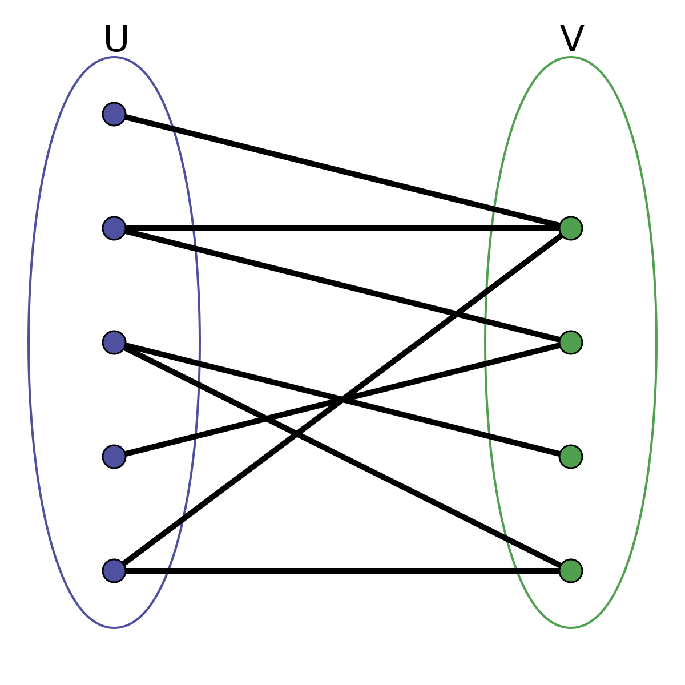

```{r setup, include=FALSE}
library(learnr)
library(gradethis)

knitr::opts_chunk$set(
	echo = FALSE,
	message = FALSE,
	warning = FALSE,
	cache = FALSE
)

source("../R/helper_code.R")

# Check whether required packages are installed
pkgs <- matrix(c(
  "learnr", "0.10.0", "CRAN",
  "gradethis", "0.2.3.9001", "rstudio/gradethis",
  "igraph", "1.2.6", "CRAN",
  "knitr", "1.34", "CRAN",
  "sna", "2.6", "CRAN",
  "SNA4DSData", "0.9.904", "SNAnalyst/SNA4DSData",
  "ergm", "4.1.2", "CRAN",
  "network","1.17.1" , "CRAN",
  "texreg", "1.37.5" , "CRAN",
  "GERGM", "0.13.0" , "matthewjdenny/GERGM"
), byrow = TRUE, ncol = 3) |> 
  as.data.frame() |> 
  setNames(c("pkg", "version", "where"))

check_pkgs <- function(.pkgs = pkgs) {
  SNA4DS:::check_packages(.pkgs)
}

# RStudio, at least 4.1717
check_RStudio <- SNA4DS:::check_rstudio


# R check version (required 4.1.1)
check_R <- function(x) {
  SNA4DS:::check_r_equal(4, 1.1)
}
```


```{css, echo = FALSE}
.tip {
  border-radius: 10px;
  padding: 10px;
  border: 2px solid #136CB9;
  background-color: #136CB9;
  background-color: rgba(19, 108, 185, 0.1);
  color: #2C5577;
}

.warning {
  border-radius: 10px;
  padding: 10px;
  border: 2px solid #f3e2c4;
  background-color: #f3e2c4;
  background-color: rgba(243, 226, 196, 0.1);
  color: #775418;
}

.infobox {
  border-radius: 10px;
  padding: 10px;
  border: 2px solid #868e96;
  background-color: #868e96;
  background-color: rgba(134, 142, 150, 0.1);
  color: #2F4F4F;
}

# # create a horizontal scroll bar when code is too wide
# pre, code {white-space:pre !important; overflow-x:auto}
```

```{html, echo = FALSE}
<style>
pre {
  white-space: pre-wrap;
  background: #F5F5F5;
  max-width: 100%;
  overflow-x: auto;
}
</style>
```


## Introduction 

Since now you rock the basic one, welcome to the magical mystery tour on advanced ERGMs!

In this tutorial, we are going to cover two types of advanced ERGMs. First, the bipartite. It can be specified as a particular option of the regular ERGM with the `ergm` package. Second, we are going to learn the weighted ERGM, which requires a new package named `GERGM`, standing for Generalized Exponential Random Graph Models

Put your seat belt on, and let's go!

{width=75%}

## Packing up for the tour!

Before we start the magical mystery tour, we need to make sure we carry our essentials in the backpack!


### R Version 

You need to have installed R version 4.1.1 and this tutorial is going to check it
for you. Please hit the `Run Code` button.

```{r r_check, echo = TRUE, include = TRUE, exercise = TRUE}
check_R()
```


### R Studio Version

You need to have installed RStudio version 2021.9.0.351 or above.
Let's check by clicking `Run Code`:

```{r rstudio_check, echo = TRUE, include = TRUE, exercise = TRUE}
check_RStudio()
```


### Packages

You need to have a few packages installed. 
Click the `Run Code` to check. 
It will check whether you have the required packages installed and will 
attempt to install any missing packages in case there are any (or it will 
advise you to upgrade `SNA4DS`).

```{r package_check, echo = TRUE, include = TRUE, exercise = TRUE}

check_pkgs()

```


All packed up! Let's roll!!

## Bipartite ERGMs

Bipartite ERGMs require a bipartite network. DUH!

Just to be clear. A bipartite network has two sets of nodes that can be connected to each other but not within, as in the image below.

{width=75%}

Even if the concept of bipartite network is pretty straightforward, 
Setting up your network as a bipartite to be ready for a bipartite ERGM with the `ergm` package is not that simple. 

Let's see how to do it step by step. 

### Setting up a network as bipartite

Both unimodal and bipartite networks can be expressed as node lists, but while unimodal networks can also be represented by adjacency matrices, bipartite networks require incidence matrices.

While adjacency matrices are squared, with the same items in rows and columns, incidence matrices have the first set of elements in rows and the second set in columns. Hence if we have a bipartite network of 10 friends going to Cinema Club four times in total, we will get an incidence matrix of 10 by 4 elements. 

You can import a bipartite network in the `network` package (that we need to run ERGMs with the `ergm` package) both using the edge list and the incidence matrix. 

Let's see how to do it with an incidence matrix. 

```{r load_IncMat, include = FALSE}

mdata <- matrix(c(1, 1, 1, 1, 1, 0, 0, 1, 0, 0, 1, 1, 1, 1, 1, 1, 0, 0, 0, 0, 1, 0, 1, 0, 0, 1, 1, 1, 1, 1, 1, 0, 0, 0, 1, 1, 1, 1, 1, 1), 10, 4)

vertex.names <- c(LETTERS[1:10], 1:4)

Age <- c(6, 7, 7, 7, 9, 9, 10, 9, 12, 12, NA, NA, NA, NA)

Gender <- as.character(c(0, 0, 0, 0, 0, 1, 1, 1, 1, 1, NA, NA, NA, NA))

kidsnet <- network::network(mdata, directed = FALSE, bipartite = TRUE)

```

Let's take a look at our incidence matrix 

```{r bip01, exercise = TRUE, exercise.setup = "load_IncMat"}
mdata
```

Our first set of nodes (rows) is constituted by 10 kids, while our second set is constituted by 4 playdates the kids go to. 

Let's turn it into a `network` object. We need to specify that it is a bipartite and undirected network.


```{r bip02, exercise = TRUE, exercise.setup = "load_IncMat"}
kidsnet <- network::network(mdata, directed = FALSE, bipartite = TRUE)
kidsnet
```

Ok, we are done! Is this enough? Well, no. Let's insert attributes. Shall we? 

We already have three attributes stored in 3 vectors, respectively called "vertex.names", "Age", "Gender". 

We simply need to include them in the `network` object.

```{r bip03, exercise = TRUE, exercise.setup = "load_IncMat"}

network::set.vertex.attribute(kidsnet, "vertex.names",  vertex.names)
network::set.vertex.attribute(kidsnet, "Age",  Age)
network::set.vertex.attribute(kidsnet, "Gender",  Gender)

kidsnet
```


At this point, you might really think we are done. Are we? In fact, we are not. We need to pass an extra attribute to the network so that it is crystal clear that we are dealing with a bipartite. 

Here a fun fact for you. The `ergm` developers included a typo in the package. So we are going to code an attribute named "bipratite". The typo attribute needs to have the same dimension as the first partition. So in our case, it will be 10.
 


```{r bip04readynet, exercise = TRUE, exercise.setup = "bip03"}

network::set.vertex.attribute(kidsnet, "bipratite", value = rep(10, 10), v = 1:10)

kidsnet
```

Now we are done and ready to crunch some numbers!

### Fitting a bipartite ERGM 

From now on, when we fit a model, we rely on the 7 step flow approach introduced in the ERGM2 Lab: 

1. Literature research/ Questions & Hypotheses (based on the literature) [- data collection]
2. Data Exploration + terms selection
3. Running models (baseline, exploratory models, final model)
4. MCMC diagnostics of the model selected as the best
5. Goodness of fit
6. Interpreting results
7. Write up about your research telling how this journey went

#### Step One

As world experts in children behavior and play-date-ology (just kidding!), we are fully aware of the literature, and we specify three hypotheses

1. Older kids go to more playdates
2. There is homophily by gender (girls play with girls, boys play with boys)
3. Some play dates have more attendees than others

#### Step two

Let's Inspect our data. 

First, we should get to know our attributes.

```{r bip05, exercise = TRUE, exercise.setup = "bip04readynet"}

network::get.vertex.attribute(kidsnet, "Age")
class(network::get.vertex.attribute(kidsnet, "Age"))

network::get.vertex.attribute(kidsnet, "Gender")
class(network::get.vertex.attribute(kidsnet, "Gender"))


```

Then, we get acquainted with some network structural features, such as degree

```{r bip06, exercise = TRUE, exercise.setup = "bip04readynet"}


# Total degree
summary(kidsnet ~ degree(1:10))

# Degree partition 1 (kids)
summary(kidsnet ~ b1degree(1:10))

# Degree partition 2 (play-dates)
summary(kidsnet ~ b2degree(1:10))

```

and stars


```{r bip06_01, exercise = TRUE, exercise.setup = "bip04readynet"}


# Total 2 to 10 stars
summary(kidsnet ~ kstar(2:10))

# 2 to 4 stars partition 1 (kids) --- max 4 playdates (max possible degree)
summary(kidsnet ~ b1star(2:4))

# 2 to 10  stars partition 2 (play-dates) --- max 10 kids (maximum possible degree)
summary(kidsnet ~ b2star(2:10))

```


Hence, we can now specify our terms, 

H1. `b1cov("Age")`
H2. `b1nodematch("Gender")`
H3. some stars or degree terms

Rember that the bipartite terms are different from the unimodal one. 

You can explore them using the function:

`ergm::search.ergmTerms(categories = 'bipartite')`

#### Step 3


First baseline models and dyadic independent exploratory models


```{r bip07, exercise = TRUE, exercise.setup = "bip04readynet"}

m0 <- ergm::ergm(kidsnet ~ edges)
summary(m0)

m1 <-ergm::ergm(kidsnet ~ edges + b1cov("Age"))
summary(m1)

m2 <-ergm::ergm(kidsnet ~ edges + b1nodematch("Gender"))
summary(m2)


```


Now we can run dyadic dependent exploratory models. Since the dyadic dependent involves a simulation, they are computationally more intense. To reduce the computational time and make the model work better, we can try to do two things. 

First, we should constraint the model. For instance, in the example below, I'm asking the simulation to exclude networks with nodes having degrees lower than (isolate) 0 and larger than 14 (max N nodes) since they would be unrealistic in the current situation that we are exploring.

Second, we can control the model specifying how the simulation should run.

Let's get to it.


```{r bip08, exercise = TRUE, exercise.setup = "bip04readynet"}

m3 <-ergm::ergm(kidsnet ~ edges + b1star(2), 
                constraints = ~ bd(minout = 0, maxout=14),
                control = ergm::control.ergm(MCMC.burnin = 5000,
                                             MCMC.samplesize = 10000,
                                             seed = 1234,
                                             MCMLE.maxit = 20))
summary(m3)


```


Finally, we can run a complete model!


```{r bip09finMod, exercise = TRUE, exercise.setup = "bip04readynet"}

m5 <-ergm::ergm(kidsnet ~ edges + b1cov("Age") + b1nodematch("Gender") + b1star(2), 
                constraints = ~ bd(minout = 0, maxout=14),
                control = ergm::control.ergm(MCMC.burnin = 5000,
                                             MCMC.samplesize = 10000,
                                             seed = 1234,
                                             MCMLE.maxit = 20))
summary(m5)

```


#### Step four

Let's assume that we selected our best model comparing AIC and BIC across them, and we now move on to check the MCMC diagnostics.

Is this model good? 

```{r bip10, exercise = TRUE, exercise.setup = "bip09finMod"}

ergm::mcmc.diagnostics(m5)


```

If and only if you think that the model is good enough, you can move to the goodness of fit. Otherwise, get back and try a different model specification (getting back to steps 1, 2, 3).


#### Step 5

Let's assume that it is good enough for now...

```{r bip11, exercise = TRUE, exercise.setup = "bip09finMod"}

ergm::gof(m5)

```

Is the goodness of fit good? If and only if you think that the model is good enough, you can move to the interpretation of results! Otherwise, get back and try a different model specification (getting back to steps 1, 2, 3).

#### Step 6

The model we run (m5) seems nice enough to read results according to steps 4 and 5. Ok, let's read the results!

Let's look at coefficients and odd ratios first.

```{r bip12, exercise = TRUE, exercise.setup = "bip09finMod"}


SNA4DS::Ef_int(m5, type = "odds")

```

The only significant term in the model is `nodematch` by gender. Interpreting the coefficient, we know that kids of the same gender tend to attend the same playdates. The extent to which kids go to a certain party (form edges) increases if the kids are both girls or boys.

Interpreting the odds ratio ($2.375$), we know that this effect is really strong since the OR is much larger than 1. 

Let's look at probabilities.

```{r bip13, exercise = TRUE, exercise.setup = "bip09finMod"}

SNA4DS::Ef_int(m5, type = "prob")

```

Looking at the probabilities, we know that the probability of kids of the same gender attending the same play date is 70.4 % ($0.704*100$). Waw! this is really a strong effect, and it is in line with the OR, just easier to interpret!

### Step 7

Well, in this tutorial, we can skip the step where we write up the results (since I already wrote up all the narratives step by step!), but don't forget to include this step in your future analyses!

Enough about bipartite! We can now move to mystery tour part two: the weighted ERGMs!

## Weighted ERGMs

Here we go with weighted networks! This kind of network is also expressed as an adjacency matrix. Still, rather than having a matrix populated by 0s and 1s, we have a matrix populated by any other number representing a weight. These weights imply that some edges might define stronger relationships than others. 

Even if any graph can have a weight, with weighted ERGMs, we can only analyze fully connected graphs.

The type of weight makes a real difference. 

If the weight attributed to the edges of a fully connected graph is a count variable, we can run an ERGM using a variant of the `ergm` package called `ergm.count`. 

This would work in a situation when we have three waves of friendship data that we recode as 

* friends for 1 year - weight 1
* friends for 2 years - weight 2
* friends for 3 years - weight 3

This is a count variable. The weight must be larger than 0 (non-negative), and it cannot be in between the categories that it describes.

However, weight can express many other realities that need more complex definitions, such as the money export between countries measured in dollars. The `GERGM` package can handle both the count weight and the more complex cases, and for this reason, we are going to move out of the `statnet` environment for this kind of models. 


Let's take a look at a real case study published by 

`James D. Wilson, Matthew J. Denny, Shankar Bhamidi, Skyler Cranmer, and Bruce Desmarais (2017). “Stochastic weighted graphs: Flexible model specification and simulation”. Social Networks, 49, 37–47.`

We have 17 countries exchanging money with each other (international trade) in 2005.

```{r weightloadData, echo = FALSE}


data("lending_2005", package = "GERGM")
data("covariate_data_2005", package = "GERGM")
data("net_exports_2005", package = "GERGM")

```

This is how this weighted network looks like

```{r weight01, exercise = TRUE, exercise.setup = "weightloadData"}

GERGM::plot_network(lending_2005, seed = 123, 
                    white_background = TRUE, 
                    show_legend = FALSE) 

```


Do you see the function for plotting? It is very different from what we used before. It is because the `GERGM` package does things in its own way.

### Importing the Data

Since the `GERGM` package has its own environment, it does not rely either on `igraph` not `network` formats. 
You need to pass row data (weighted adjacency matrices and data frames) to this model. 


Let's inspect the weighted matrix.

```{r weight02, exercise = TRUE, exercise.setup = "weightloadData"}

lending_2005

```


and also the covariates

```{r weight03, exercise = TRUE, exercise.setup = "weightloadData"}
covariate_data_2005
```


### Running a weighted ERGM

Ok, let's display this research using our seven-steps flow. 

#### Step one (Theory/Questions/Hypotheses)

As usual, let's assume that we are experts in international trade and fully aware of this stream of research so that we can already formulate hypotheses. 

* 1. trade is mutual (If country A sells and buy to/from B, B sells and buy to/from A)
* 2. The GDP is associated with the probability of sending more money (high weight ties)
* 3. The GDP is associated with the probability of receiving more money (high weight ties)

#### Term Specicifation
The terms are a bit different than the `ergm` package, but not that much.

* 1. `mutual`
* 2. `sender`
* 3. `receiver`

Unlike the `ergm` set up, in the `GERGM` one, we can attach an attribute to the sender and receiver effects.

### Step two (Data Exploration)


Let's explore the covariates we have in our data set.


```{r weight04, exercise = TRUE, exercise.setup = "weightloadData"}

head(covariate_data_2005)


```

We have three covariates. Our hypotheses require us to focus on GDP. Since the GDP is really high, it is convenient to work with its log function.


```{r weight05, exercise = TRUE, exercise.setup = "weightloadData"}
class(covariate_data_2005$log_GDP)
```


Ok, now we know how to specify the model. Don't we?

#### Step three (model specification)

Let's start with the baseline. If we don't specify any option in `edges`, it will work as it does in the `ergm` package. We can also decide to include an intercept in the weighted part of the model. We specify the second option using `edges(method = "regression")` if we want to do so. Why don't you try to see what happens?

Note1: In the `GERGM` environment, you specify the formula of the ERGM before running the model. 

Note2: In the `GERGM` environment, a baseline model with `edges` only does not work. Hence try directly with the other variables.

NOTE3: This model might be too heavy to run in your tutorial, depending on your computer. If it does not run, run it on `Rstudio` directly. You can load the data using the `data` function. 

`data("lending_2005", package = "GERGM")
data("covariate_data_2005", package = "GERGM")
data("net_exports_2005", package = "GERGM")`

As you can see in the specification, this data set is located in the `GERGM` package itself. 


```{r weight06, exercise = TRUE, exercise.setup = "weightloadData"}
formula0 <- lending_2005 ~ edges + mutual


m0 <- GERGM::gergm(formula0,
                   covariate_data = covariate_data_2005,
                   number_of_networks_to_simulate = 40000,
                   thin = 1/100,
                   proposal_variance = 0.05,
                   MCMC_burnin = 10000,
                   seed = 456,
                   convergence_tolerance = 0.5)
```


Why don't you run other exploratory models here by trying some other terms? I give you the final one below, but first try to play a little :)

NOTE: This model might be too heavy to run in your tutorial, depending on your computer. If it does not run, run it on `Rstudio` directly. You can load the data using the `data` function. 

`data("lending_2005", package = "GERGM")
data("covariate_data_2005", package = "GERGM")
data("net_exports_2005", package = "GERGM")`

As you can see in the specification, this data set is located in the `GERGM` package itself. 

```{r weight07, exercise = TRUE, exercise.setup = "weightloadData"}
formula1 <- lending_2005 ~ edges + sender("log_GDP")


m1 <- GERGM::gergm(formula1,
                   covariate_data = covariate_data_2005,
                   number_of_networks_to_simulate = 40000,
                   thin = 1/100,
                   proposal_variance = 0.05,
                   MCMC_burnin = 10000,
                   seed = 456,
                   convergence_tolerance = 0.5)
```


Ok, let's get to our final model. 

NOTE: This model might be too heavy to run in your tutorial, depending on your computer. If it does not run, run it on `Rstudio` directly. You can load the data using the `data` function. 

`data("lending_2005", package = "GERGM")
data("covariate_data_2005", package = "GERGM")
data("net_exports_2005", package = "GERGM")`

As you can see in the specification, this data set is located in the `GERGM` package itself. 


```{r weight08, exercise = TRUE, exercise.setup = "weightloadData"}
formula4 <- lending_2005 ~ edges + mutual(alpha = 0.8) + sender("log_GDP") + 
  receiver("log_GDP")

m4 <- GERGM::gergm(formula4,
                     covariate_data = covariate_data_2005,
                     number_of_networks_to_simulate = 40000,
                     thin = 1/100,
                     proposal_variance = 0.05,
                     MCMC_burnin = 10000,
                     seed = 456,
                     convergence_tolerance = 0.5)
```

#### Step four (MCMC diagnostics)

Even if the `GERGM` models automatically print info about the quality of the model, it is possible to reprint them separately too. 

Here we can observe the MCMC diagnostics.

```{r weight09, exercise = TRUE, exercise.setup = "weight08"}
GERGM::Trace_Plot(m4)
```


Since this model is different from the regular ERGM, the trace plot doesn't need to be centered at 0. Instead, there is a black line telling you where the trace plot should be centered. Does this look good to you? 

```{r testquiz, echo = FALSE}
question("Does the trace plot look good to you? ",
    answer("Yes, the spikes are reaching the bottom and the top of the plot,"),
    answer("A bit, the chain is mixing well, and the several iteraition of the simulation vary smoothly "),
    answer("No, the chain is not mixing well, and the plot is not centered on the black line", correct = TRUE)
  )
```

#### Step five (Goodness of Fit)

Same story for the goodness of fit. Even if the models produce it automatically, you can recall it this way.

```{r weight10, exercise = TRUE, exercise.setup = "weight08"}

GERGM::GOF(m4)
```

```{r testquiz1, echo = FALSE}
question("Does this fitlook good?? ",
    answer("Yes, since the observed mean match with the simulated ones"),
    answer("A bit, since the observed mean match with the simulated ones most of the time but not always", correct = TRUE),
    answer("No, since the observed mean never match with the simulated ones")
  )
```


#### Step Six 

How about the results? Well, this model is pretty bad, but let's learn how to explore them anyway, pretending that it is ok!

The package already provides an inbuilt estimates plot. Red means significant other colors, the opposite. But a table with coefficient could be nice too, right? Here we go.

```{r weight11, exercise = TRUE, exercise.setup = "weight08"}

GERGM::Estimate_Plot(m4)

(EstSE <- rbind(t(attributes(m4)$theta.coef),
               t(attributes(m4)$lambda.coef)))

```

Mutual is not significant, so apparently, trade is a one-way operation. But sender and receiver for what concerns GDP are! It seems that if we take GDP into account, we can predict the intensity of the trade relationship (the weight of the edge). In fact, here, we don't only predict the existence of an edge but also the strength of the edge. GDP seems to be positively associated with trade. Countries with higher GDP trade more, both are sending and receiving goods. It makes sense, right? 

How much does GDP influence the relationships between nodes? Well, up to you to check odds ratios and probabilities to find out :)


## Conclusion

Our magical mystery tour is coming to an end. Now you can fly back home like a rocket with your advanced ERGM graduation hat!

Be ready to jump into a time machine with temporal ERGM (TERGM) next week!

{width=75%}
