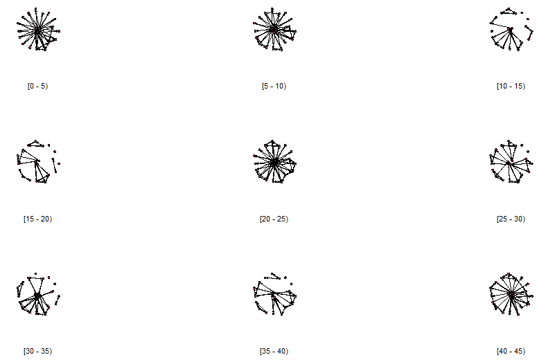

```{r setup, include=FALSE}
library(learnr)
library(gradethis)
library(magrittr)
tutorial_options(exercise.checker = gradethis::grade_learnr)

knitr::opts_chunk$set(
	echo = FALSE,
	message = FALSE,
	warning = FALSE,
	cache = FALSE
)

source("../R/helper_code.R")

# Check whether required packages are installed
pkgs <- matrix(c(
  "learnr", "0.10.0", "CRAN",
  "gradethis", "0.2.3.9001", "rstudio/gradethis",
  "igraph", "1.2.6", "CRAN",
  "knitr", "1.34", "CRAN",
  "sna", "2.6", "CRAN",
  "SNA4DSData", "0.9.91", "SNAnalyst/SNA4DSData",
  "ergm", "4.1.2", "CRAN",
  "network","1.17.1" , "CRAN",
  "ndtv","0.13.2" , "CRAN",
  "tsna", "0.3.5" , "CRAN",
  "networkDynamic", "0.11.0" , "CRAN"
), byrow = TRUE, ncol = 3) |> 
  as.data.frame() |> 
  setNames(c("pkg", "version", "where"))

check_pkgs <- function(.pkgs = pkgs) {
  SNA4DS:::check_packages(.pkgs)
}

# RStudio, at least 4.1717
check_RStudio <- SNA4DS:::check_rstudio


# R check version (required 4.1.1)
check_R <- function(x) {
  SNA4DS:::check_r_equal(4, 1.1)
}


library(networkDynamic, quietly = TRUE)
library(ndtv, quietly = TRUE)
data("McFarland_cls33_10_16_96", package = "networkDynamic")
classroom <- cls33_10_16_96

par("mar" = c(0, 0, 0, 0))
```

```{css, echo = FALSE}
.tip {
  border-radius: 10px;
  padding: 10px;
  border: 2px solid #136CB9;
  background-color: #136CB9;
  background-color: rgba(19, 108, 185, 0.1);
  color: #2C5577;
}

.warning {
  border-radius: 10px;
  padding: 10px;
  border: 2px solid #f3e2c4;
  background-color: #f3e2c4;
  background-color: rgba(243, 226, 196, 0.1);
  color: #775418;
}

.infobox {
  border-radius: 10px;
  padding: 10px;
  border: 2px solid #868e96;
  background-color: #868e96;
  background-color: rgba(134, 142, 150, 0.1);
  color: #2F4F4F;
}

# # create a horizontal scroll bar when code is too wide
# pre, code {white-space:pre !important; overflow-x:auto}
```

```{html, echo = FALSE}
<style>
pre {
  white-space: pre-wrap;
  background: #F5F5F5;
  max-width: 100%;
  overflow-x: auto;
}
</style>
```

## Welcome

Until now, the tutorials have focused on the analysis of static
networks, that is: networks that do not change. The networks you
considered were stable over time (or stable enough to be considered to
be stable) and analyzed that. You learned how to visualize the networks,
calculate vertex-level statistics, edge-level statistics, graph-level
statistics, and perform statistical tests on the networks and built
statistical models of networks. That's a lot, you've done a lot already
in this course.

At the same time, this is only the beginning of the journey. There are
very many topics, models, and approaches left. In this tutorial, we are
going to look at one extension of networks: networks that change over
time. There are many names for this type of network, and we will call
them *temporal networks* in this tutorial.

There are many different kinds of temporal networks and you can do a
great many things with this type of data.

In the lecture, you learned how to apply ERGM's to temporal networks.
These models deal with a set of repeated observations of a network. For
example, you can look at collaborative projects between organizations
and measure the network once every month (or quarter, or year, of
whatever is appropriate for your study at hand). Here, you do not know
exactly when each edge started or ended, you only know what it is like
when you measure it. Of course, this requires the assumption that your
data are stable enough to justify measuring only every other month,
quarter, year, or whatever frequency you adopt in your study. In many
cases, this works quite well.

In this tutorial we will consider a specific type of temporal network: a
network where

-   you know the starting and ending times of each edge (where edges are
    allowed to start and end multiple times during the observation
    period);

-   you know the starting and ending times of each possible vertex (and
    vertices are allowed to join and leave the network multiple times
    during the observation period);

-   the attributes of the edges are potentially dynamic (but may be
    static as well), and you record at what time edges have what value;

-   the attributes of the vertices are potentially dynamic (but may be
    static as well), and you record at what time vertices have what
    value;

-   the time points follow a meaningful scale and can be integers or
    continuous values.

You will find that we can build on a lot of the things you have already
learned in this course, both conceptually and programming-related. At
the same time, thinking about dynamics is hard for everybody, and you
will find you will have to rethink some of the earlier concepts you
learned in the context of static networks.

In this tutorial, we will make a first start with considering this type
of data.

Ready for the adventure? Let's get started!

> ***Let's do some time travel!***


## Buckle up!

Before we start our time travel, we need to make sure we have our belts
on, have enough toilet paper with us, and our teeths brushed.

Let's check if we are ready for take-off.

### R Version

You need to have installed R version 4.1.1 (or higher) and this tutorial
is going to check it for you. Please hit the `Run Code` button.

```{r r_check, echo = TRUE, include = TRUE, exercise = TRUE}
check_R()
```

### R Studio Version

You need to have installed RStudio version 2021.9.0.351 or above. Let's
check by clicking `Run Code`:

```{r rstudio_check, echo = TRUE, include = TRUE, exercise = TRUE}
check_RStudio()
```

### Packages

You need to have a few packages installed to ensure safe travels. Click
the `Run Code` to check. It will check whether you have the required
packages installed and will attempt to install any missing packages in
case there are any (or it will advise you to upgrade `SNA4DS`).

```{r package_check, echo = TRUE, include = TRUE, exercise = TRUE}

check_pkgs()

```

### Lift off!

And you are ready for lift off! Let's blast into space.

> **IGNITION!**


## Temporal network data

The example we will use throughout this tutorial is based on data
gathered by [Daniel
McFarland](https://ed.stanford.edu/faculty/mcfarland), a really nice and
really smart colleague with whom we have an active research
collaboration.

The data set we use here is of the interactions between teachers and
students in a classroom for a single 45-minute lesson. McFarland
actually coded many classes and many lessons, and we are going to focus
on one such network.

In this data set, a classroom had 18 pupils and two instructors (ie. the
regular instructor and a guest instructor). Hence, there are 20 vertices
in the network. Several attributes were coded of the vertices: gender
and role, these are constant. Further, for the edges the type of
interaction ("task" and "sociable") is coded and the weight of the
interaction (somewhat arbitrarily assessed by the coder).

The researchers wanted to understand the interaction dynamics in this
classroom and coded the network of conversation throughout the lesson.
Each conversation has a "sender" (ie. the person talking) and a
"receiver" (ie. the person(s) talked to).

The class is an economics class composed of 11th and 12th graders. On
this day, economics has two teachers. The first is the usual teacher and
the second is a businessman who donates his time a couple days a month
to assist the class with their lesson on stock investments. After a
minute of undefined class time, the two teachers prescribe collaborative
group work and assist students in conducting it. The students are
assigned groups within which they are to study the stock market and make
mock investments they can follow over time. The groups compete with each
other over the course of the semester to see who can make the greatest
profit.

Anyway, let's look at the data. It is available for you under the name
*classroom*.

If we would think this was a regular `network` object, we would look at
it like this:

```{r look, exercise = TRUE}
network::print.network(classroom)
```

Do you notice it has attributes that have the suffix "active"?

Let's plot it:

```{r plot_static, exercise = TRUE}

```

```{r plot_static-solution}
plot(classroom)
```

```{r plot_static-check}
gradethis::grade_code(correct = "Nice work")

```

How about some basic measures:

```{r basics, exercise = TRUE}
sna::gden(classroom)
sna::components(classroom)
sna::centralization(classroom, FUN = sna::betweenness)
```

And look at some of the attributes:

```{r basics2, exercise = TRUE}
network::list.edge.attributes(classroom)
network::list.vertex.attributes(classroom)
network::get.vertex.attribute(classroom, "gender")
```

This all works.

But wait, where's the dynamics? Why does this even work? And what do
these measures even mean, considering that these are temporal networks?

## R packages

The `classroom` network is different from a static network, in that it
contains information on *when* edges and vertices are active and in that
it allows values to change over time. At the same time, the data object
is built in the same manner as the `network` object you have become used
to. All R packages that belong to the `statnet` suite of packages are
mutually compatible, which is why
`network::list.edge.attributes(classroom)` and `sna::gden(classroom)`
worked, even though `classroom` is a temporal network.

In this tutorial, we will use three new packages, all coming from
`statnet`.

-   `networkDynamic` manages temporal networks, similar to `network`

-   `tsna` implements network measures, similar to `sna`

-   `ndtv` implements the visualization of temporal networks, in a way
    that is somewhat similar to `sna::gplot` or `network::plot`.

These are the three packages we will use in this tutorial.

Rather than the object being of class `network`, the temporal network is
of class `networkDynamic`. So, what happens when we run `sna` on an
object of class `networkDynamic`? Well, it treats the network as static
and discards its temporal features. This can be useful when you want to
get a idea of the overall network, but it does provide you with a biased
understanding of how the interactions in the network evolve.

Same thing with `plot`. Using the `network` or `sna` implementation of
`plot` will plot a static representation, discarding temporal changes.

## networkDynamic

Now, let's look at the object as a temporal network object.

```{r nd1, exercise = TRUE}
classroom
```

OK, so it looks similar to a `network` object, but with additional
traits.

One way to look at the data is by turning it into a `data.frame`:

```{r asdf, exercise = TRUE}
as.data.frame(classroom)
```

You see that each edge now has temporal information. The most important
are:

-   onset: the starting time of the edge
-   terminus: the ending time of the edge
-   tail: the sender (in a directed network): the starting vertex of the
    edge
-   head: the receiver (in a directed network): the ending vertex of the
    edge

The other columns of the `data.frame` are automatically created by
`networkDynamic`.

There are many ways to create a dynamic network object. The general
function is `networkDynamic::networkDynamic()` and you can feed it many
different types of input, such as:

-   a static network representation
-   a `data.frame` like the one above (this is called a `data.frame`
    with *edge spells*), optionally extended with edge attributes
-   a `data.frame` that has the onset and terminus values for each
    vertex (this is called *vertex spells*), optionally extended with
    vertex attributes
-   a `data.frame` that contains the times at this edges (*edge
    toggles*) or vertices (*vertex toggles*) turn on and off
-   a list of networks observed at consecutive time periods
-   various other kinds of inputs

As you can see, there are many ways in which temporal networks can be
created and various kinds of inputs can be combined. If you need to
construct such a network, you can consult the help for the function in
R. Also, Claudia and I can assist you. However, for this course, we will
not focus on this part.

## Manipulating networkDynamic objects

Since `networkDynamic` is built to be compatible with the `network`
package, many of its functions will be familiar to you. You should
easily be able to extract vertex attributes or edge attributes. But now,
the values of these attributes may vary over time. Hence, we need to
specify for what time period we want our info. Can you figure out what
these function calls do? I suggest you play around with them a bit, to
familiarize yourself with how this works. Check the help if you want
more detail.

```{r attrs1, exercise = TRUE, exercise.lines = 10}
networkDynamic::list.vertex.attributes.active(classroom)
networkDynamic::get.vertex.attribute.active(classroom, "gender", at = 1)
networkDynamic::get.vertex.attribute.active(classroom, "gender", onset = 0, terminus = 49)
networkDynamic::list.edge.attributes.active(classroom, at = 1)
networkDynamic::list.edge.attributes.active(classroom, onset = 0, terminus = 49)
networkDynamic::get.edge.attribute.active(classroom, "active", at = 1)
```

Now, let's say you are interested in what happens in the first minute of
the lesson. There are two ways to do this.

First, `networkDynamic::network.extract` extracts the part of the
temporal network for the time period you are interested in.

```{r extract, exercise = TRUE}
net_extract <- networkDynamic::network.extract(classroom, onset = 0, terminus = 1)
as.data.frame(net_extract)
class(net_extract)
```

At time 0.125 person 14 addresses person 12, and is responded to at
0.250. Then, person 18 makes a comment to person 12 as well (at 0.375)
and also gets a response (at 0.500). Person 12 is apparently popular, as
person 1 addresses him immediately after at 0.625 and gets a response at
0.750. Then, finally, other interactions ensue in the classroom,
starting at 0.875 when 14 addresses 17.

Alternatively, you can collapse what happens in that first minute into a
consolidated static network.

```{r collapse, exercise = TRUE}
net_collapse <- networkDynamic::network.collapse(classroom, onset = 0, terminus = 1)
as.data.frame(net_collapse)
class(net_collapse)
```

You can see this is now a static network, since it only includes the
edges without any time information. The class of the object is now
`network`.

SO, if you wanted to compute the number of components for each quarter
of an hour, this would be an appropriate way to do so (although you
could consider cleaning the data a bit during the process):

```{r collapse2, exercise = TRUE}
net_1 <- networkDynamic::network.collapse(classroom, onset = 0, terminus = 14.99)
net_2 <- networkDynamic::network.collapse(classroom, onset = 15, terminus = 29.99)
net_3 <- networkDynamic::network.collapse(classroom, onset = 30, terminus = Inf)
sna::components(net_1)
sna::components(net_2)
sna::components(net_3)
```

## Measures over time

You just computed components across a couple of intervals, using the
`sna` package on collapsed sub-networks. You can also make this process
simpler by using the `tsna` package. This package has a function
`tsna::tSnaStats` that allows you to compute any measure from the `sna`
package on a series of sub-networks. You do this as follows.

```{r sna1, exercise = TRUE}
tsna::tSnaStats(classroom, snafun = "components", time.interval = 15, aggregate.dur = 15)
```

This collapses the network into intervals. At each step of 15
(`time.interval`) it extracts data of length 15 (`aggregate.dur`). So,
the function creates the sub-networks from time [0, 15), [15, 30), [30,
45), [45, 49) and then applies the `sna` function `components` to each
sub-network.

You get the same results as above (but now you have four intervals
instead of three before).

This creates interesting ways to analyze the evolution of the network.
For example, you can compute how the density of the network develops.
Below, compute the density of the network for blocks of 5 minutes and
plot how it develops.

```{r remedy003, exercise = TRUE}

```

```{r remedy003-solution}
tsna::tSnaStats(classroom, snafun = "gden", time.interval = 5, aggregate.dur = 5)
```

```{r remedy003-check}
gradethis::grade_result(
  pass_if(~identical(.result, tsna::tSnaStats(classroom, snafun = "gden", time.interval = 5, aggregate.dur = 5)), "Wonderfully done!")
)
```

The `tsna` package implements several measures. Let's calculate
betweenness centralization at times 0, 5, 10, et cetera, each time over
a period of length 5 minutes. Then plot the result (adapt the code below
to do it).

```{r betw, exercise = TRUE}
betws <- tsna::tSnaStats(classroom, snafun = ..., 
        time.interval = 5, aggregate.dur = 5,
        FUN = ..., 
        cmode = "directed")
...
```

```{r betw-solution}
tsna::tSnaStats(classroom, snafun = "centralization", time.interval = 5, aggregate.dur = 5,FUN = sna::betweenness, cmode = "directed") |> plot()
```

Can you interpret what you see? What does the plot say about the
dynamics over the interaction in this classroom during the lesson?
Pretty clear, right?

## Duration

In static networks, edges are present or not (and can vary in their
value). In temporal networks, edges are sometimes "on" and at other
times "off". When we have access to longer duration longitudinal network
data sets, we can examine networks in terms of temporal
characterizations of edge activity without first chopping the network up
into bins. For example, what are the average durations of edge activity?

```{r edgeduration, exercise = TRUE}
edgeDuration <- tsna::edgeDuration(classroom, mode = "counts")
summary(edgeDuration)
plot(edgeDuration, type = "l")
```

Since we specified `mode = "counts"`, this tells you how many times the
edge occured during the observation time (of course, you can also
specify a time interval you want to consider, rather than the entire
data set). The function also offers you the option to calculate *how
much time* an edge was active. However, since the edges in this
particular data set have no time length (ie. they all have a duration of
0, see the previous "networkDynamic" section where you extracted the
`data.frame` of this graph), the total time each edge is active would
also be 0. If we had coded durations as well, we could totally do this.

What does this plot tell you about the interactions in this classroom?

Edge durations can tell us the relative rates at which individual edges
are active, but what if we want to know how active the vertices are
across their relationships? The `tsna::tiedDuration` function provides a
vertex-level aggregation of the amount of time each vertex is "in a
relationship".

```{r vertexduration, exercise = TRUE, exercise.lines = 3}
tsna::tiedDuration(classroom, mode = 'counts')
```

Again, if durations had been coded, we could have measured this in terms
of minutes.

Feel free to make a plot of this as well, potentially a line plot or a
histogram, or a density plot (or another plot you might find informative
or fun to try out here).

Do you notice there are some zeroes in here? Hmm, that is odd, because I
know for sure that person 2 did engage in conversation (again, look back
at the `data.frame` in the "networkDynamic" section). Check the help
function for `tsna::tiedDuration` and find out why person 2 has a zero
here and why this is actually correct.

You probably also noticed that the amount of talking (which is what is
measured in this network) is definitely not equally divided. Could it be
that this has to do with some vertices being instructors and the others
being pupils? Let's find out.

```{r durationvertextypes, exercise = TRUE}
data.frame(type = network::get.vertex.attribute(classroom, "type"), 
           duration = tsna::tiedDuration(classroom, mode = 'counts'))
```

Ah, that explains it!<br> (also: see how you can combine functions from
different packages together)

### Number of active edges over time

Recall that this is a network of how a classroom session unfolds in a
economics lesson. There will be times when there is a lot of talking
(when students work in subgroups on assignments and all discuss the
assignment) and times when talking activity is more focused (such as
when an instructor is talking to the group or a student is presenting a
solution).

One way of looking into some of the dynamics is to consider how many
edges are active at any given time. Actually, since the durations are
all 0 here and the lesson is likely to progress in blocks of time, let's
break up the lesson into a series of brief segments and count the number
of edges per time segment.

The `tsna` has a function to do this, but I really don't like its
implementation for the data we have here. So, let us use a function we
programmed ourselves and included in the `SNA4DS` package for you.

```{r count_edges_in_interval, exercise = TRUE}
plot(SNA4DS::count_edges_in_interval(classroom, number = 50), 
     ylab = "edges per time point")
```

You can play around with the number of time segments, here we broke up
the timeline into 50 equal-sized time segments, but you can do more or
fewer of them.

You can clearly see that there are three periods where a lot of edges
are active, and most periods the network just "murmurs on."

This counts the number of edges active in each time segment, so that is
the amount of interacting in the classroom. This may include a lot of
going-back-and-forth between some of the same pupils, so it is also
useful to look at how many *unique* pairs of students are conversing in
each time segment. In other words: does conversation occur throughout
the classroom or mainly in vary talkative dyads? If the former, the two
plots should overlap considerably. If the latter, they will be
different. Comparing the plots (or the raw numbers, without the plots)
will help you to get a grasp of what is happening in the various parts
of the lesson.

```{r count_unique_edges_in_interval, exercise = TRUE}
plot(SNA4DS::count_unique_edges_in_interval(classroom, number = 50), 
     ylab = "unique edges per time point")
```

The plots are very similar. It looks like the conversing activity in the
network is driven by general activity of edges, not so much by some
edges hijacking the conversation. (although you could certainly compute
a measure for that as well)

## Temporal paths

In static networks we frequently measure distances using the shortest
paths. In temporal networks, we need to consider the sequence of edge
timing when computing allowable 'journeys' through the network. We call
these **temporal paths**. The `tsna::tPath` function calculates the set
of temporally reachable vertices from a given source vertex starting at
a specific time.

An example will make this clearer. Let us look at the paths from vertex
12, within a brief time period from 0 to 0.9. Extract the temporal
network for that time period and display the edge activity as a
`data.frame`:

```{r tpath1, exercise = TRUE, exercise.lines = 5}

```

```{r tpath1-solution}
networkDynamic::network.extract(classroom, onset = 0, terminus = 0.901) |> 
  as.data.frame()
```

As you see, vertex12 is first spoken to by vertex14 at 0.125 and then
speaks to vertex14 at 0.250, et cetera. If vertex 12 had information to
share, where could it reach between 0 and .9 and how long would it take?

You determine that as follows:

```{r tpath2, exercise = TRUE}
tsna::tPath(classroom, v = 12, direction = "fwd", start = 0, end = .9)$tdist
tsna::tPath(classroom, v = 12, direction = "fwd", start = 0, end = .9)$gsteps
```

Here, we consider the network for a short period: 0 to 0.9. You can, of
course, consider any time period you like.

We focused on paths starting at vertex 12 (`v = 12`). You see that it
takes 0.750 minute before node 1 is reached. Indeed, starting from time
0, only at 0.75 does vertex 12 contact vertex 1. This only takes a
single step, you see this also in the `gsteps` output.

Starting at time 0, it takes until time 0.875 that information from
vertex 12 reaches vertex 17. This actually takes 2 steps: vertex 12
connects with vertex 14 at 0.250, who then connects with vertex 17 at
0.875.

There are many vertices that can not be reached from vertex 12 within
the time segment considered. They have value `Inf`.

Just think of passing networks on the soccer pitch. For example: how
many passes does it take before our most valuable offending player is
reached? Is the passing pattern performed within a particular given
amount of time? Et cetera.<br> These are temporal paths.

(note that above we considered "forward temporal paths", but you can
also consider other directions of flow, such as how long it takes for
others to reach a specific vertex)

We can plot the temporal paths, to make it more visual. Let's do that
for these paths.

```{r tpathplot, exercise = TRUE}
FwdPath <- tsna::tPath(classroom, v = 12, direction = "fwd", start = 0, end = .9)

tsna::plotPaths(
  classroom,
  paths = FwdPath,
  displaylabels = FALSE,
  vertex.col = "white", 
  edge.label.cex = 1.5
)
```

The focal vertex (vertex 12) is shown as a bigger red dot. The possible
temporal paths from vertex 12 are shown in red and the big red numbers
are the times it takes from vertex 12 to establish that edge.

Quite straightforward, really, although it make take you some time to
wrap your head around temporal data.

Now, play around with this function a bit. Try other time segments and
other vertices. Note that, if you wanted to check for backward paths
(ie. paths that end in vertex 12, rather than start there), you need to
add `type = 'latest.depart'` to the function call, because the default
settings of the function are not compatible with backward paths,
unfortunately (you will get a message about that if you forget).

## Network visualizations

In the beginning of the course, you learned how to visualize static
networks. Now, let us consider some ways to visualize how networks
evolve over time.

A first obvious way is to collapse the network into smaller time
segments and plot these the networks across these segments. We created a
function for this and included that in the `SNA4DS` package.

The function is called `SNA4DS::plot_network_slices` and takes a few
arguments: `number` is the number of equal-sized time segments you want
to divide the interval between `start` and `end` in. The argument
`digits` can be useful to round the way the time intervals are printed
in the output (otherwise, there may be a lot of decimals and that is
just not useful).

Let us plot the network across time using 9 time segments. (note that
this code has already pre-run for layout purposes in this tutorial)

```{r, eval = FALSE, echo = TRUE}
SNA4DS::plot_network_slices(classroom, number = 9, 
                    start = 0, end = 45,
                    digits = 3)
```

```{r, echo = FALSE, eval = TRUE, fig.align = 'center', out.width = "100%"}

```

Nice, right?<br> Well, the technology underneath these tutorials makes
the plots way too small, so that is why this R chunk was not interactive
for you. But if you were to run this from the console, the plot should
be nicely sized.

### ndtv

You can also make dynamic visualizations, using the `ndtv` package. This
package offers a range of visualizations for this type of of network
data. Unfortunately, the way it has been designed requires you to load
the package into your session, using `library(ndtv)`. As you will recall
from the beginning of the course, we always strongly advise you against
this practice. However, you will get all kinds of awkward errors if you
do not. It *is* possible to "hack" the package so you do not have to
load it, but that is beyond this course (and should not be necessary in
the first place).

There are two steps in creating a dynamic visualization in `ndtv`: you
first run `ndtv::compute.animation`, which determines coordinates and
other aspects of the dynamic plot. Second, you run
`ndtv::render.d3movie`, which, you guessed it, renders the actual
movie.<br>

Actually, as long as you are satisfied with the location of the nodes
and the granularity of the animation, you only need to run
`ndtv::compute.animation` once and can then experiment with different
settings in `ndtv::render.d3movie`.

But if you want to use a different network layout algorithm or make an
animation of a different time interval or use different time steps, you
need to run `ndtv::compute.animation` with those new settings and then
generate your animation.

Let's make an animation now. The code below should open a new browser
window that shows the animation. At the bottom, you will find a button
to make it run. You can pause, fast forward, et cetera. Also, there is a
slider underneath the animation that allows you to manually go through
the animation.

```{r compute, exercise = TRUE, exercise.lines = 21}
# step 0: painfully, we have to load the package into our session
library(ndtv)

# step 1: compute the settings
ndtv::compute.animation(classroom, animation.mode = "kamadakawai",
                        slice.par = list(start = 0, end = 45,
                                         aggregate.dur = 1,
                                         interval = 1, rule = "any"))

# step 2, render the animation
ndtv::render.d3movie(classroom, usearrows = TRUE, displaylabels = FALSE ,
                     bg = "#111111",
                     edge.col = "#55555599",
                     render.par = list(tween.frames = 15, 
                                       show.time = TRUE),
                     d3.options = list(animationDuration = 1000,
                                       playControls = TRUE,
                                       durationControl = TRUE),
                     output.mode = 'htmlWidget'
                     )
```

There are many arguments you can use to tweak the animation, and we
can't possibly discuss all of them here. If the animation moves too fast
for you, set `animationDuration` to a higher value. Or click on the
three horizontal lines in the upper-right of the animation window, next
to your animation, and change the duration there. Note that these lines
are black and so is your background, so you may not actually be able to
see them. In that case, there are two ways to find them:

-   change the background to white, by removing the line
    `bg = "#111111"`
-   search with your mouse in the upper right corner of the animation
    window, until you see the shape of your cursor change.

You can also output to an html widget or even a movie file. Here, we
will not focus on these, check the help file (or shoot us an email) if
you need help customizing the visualization. <br> And, of course, you
can play with the settings here as well, to get some practice.

We will show you two more versions of this plot, so you get some idea of
what you can do. First, let's color the vertices according to whether
the vertex is a pupil ("blue") or an instructor ("red"). And we will
also size the vertices according to their degree. Here is one way of
doing this:

```{r compute2, exercise = TRUE, exercise.lines = 23}
# create a vector with colors
node_color <- rep("blue", network::network.size(classroom))
node_color[network::get.vertex.attribute(classroom, "type") == "instructor"] <- "red"

# create a vector with degrees
node_degree <- sna::degree(classroom)

# animation settings do not change, no need to do those again

# render the animation
ndtv::render.d3movie(classroom, usearrows = TRUE, displaylabels = FALSE ,
                     bg = "#111111",
                     edge.col = "#55555599",
                     vertex.cex = node_degree/12,   # new line
                     vertex.col = node_color,       # new line
                     render.par = list(tween.frames = 15, 
                                       show.time = TRUE),
                     d3.options = list(animationDuration = 1000,
                                       playControls = TRUE,
                                       durationControl = TRUE),
                     output.mode = 'htmlWidget'
                     )
```

Finally, I want to keep each vertex in the same place. The moving around
of vertices is informative (because at every time point the optimal
visualization shows clearly which vertices are more central than others
within that time frame), but you lose the ability to focus on specific\
vertices. <br> We do this by first determining coordinates for the
vertices and then add these to the network object as attributes that
remain unchanged throughout the time period. <br> Then, we specify
`animation.mode = "useAttribute"` to tell the algorithm to use the "x"
and "y" attributes for the coordinates. Since these do not change,
vertices remain in the same place.

Below, we set the coordinates by asking the *kamadakawai* algorithm to
find an optimal layout for the network as a whole. But you can also
manually set these coordinates the way you like them. Or you can change
the locations of vertices at specific time points, whatever you want.
Below, we will keep the vertices in one place for the entire animation.
In order to make this happen, we have to run `ndtv::compute.animation`
again.

Also, I will make the vertex labels readable making their names visible
when you click on a vertex.

```{r prework, echo = FALSE}
node_color <- rep("blue", network::network.size(classroom))
node_color[network::get.vertex.attribute(classroom, "type") == "instructor"] <- "red"

# create a vector with degrees
node_degree <- sna::degree(classroom)
```

```{r compute3, exercise = TRUE, exercise.lines = 29, exercise.setup = "prework"}
# compute coordinates and add them to the network, constant throughout
coords <- ndtv::network.layout.animate.kamadakawai(classroom)
networkDynamic::activate.vertex.attribute(classroom, "x", coords[, 1], 
                                          onset = -Inf, terminus = Inf)
networkDynamic::activate.vertex.attribute(classroom, "y", coords[, 2], 
                                          onset = -Inf, terminus = Inf)

# new animation settings
ndtv::compute.animation(classroom, animation.mode = "useAttribute",
                        slice.par = list(start = 0, end = 45,
                                         aggregate.dur = 1,
                                         interval = 1, rule = "any"))

# render the animation
ndtv::render.d3movie(classroom, usearrows = TRUE, displaylabels = FALSE ,
                     bg = "#111111",
                     edge.col = "#55555599",
                     vertex.cex = node_degree/12,   
                     vertex.col = node_color,   
                     vertex.tooltip = 
                       paste("Vertex", network::get.vertex.attribute(classroom, "vertex.names")),
                     render.par = list(tween.frames = 15, 
                                       show.time = TRUE),
                     d3.options = list(animationDuration = 1000,
                                       playControls = TRUE,
                                       durationControl = TRUE),
                     output.mode = 'htmlWidget'
)
```

<br><br> Feel free to play around with the settings and adjust the plot
further to your liking. If you want to open the animation in a separate
browser window, then remove the line `output.mode = 'htmlWidget'` (this
will not work inside your tutorial, but should work when you work
interactively from RStudio).

## We landed safely, back in our own timezone!

That was an adventurous ride through time! You safely landed your time
capsule, great work!

With these tools, you can now unravel quite complicated network
patterns, taking into account how they unfold through time. You gained
the ability to travel forwards and backwards through time.

Does it feel like this?

{width="282"}

{width="275"}

Couple this with your knowledge of temporal ERGM's, and you can
formulate and test quite advanced hypotheses of how interactions unfold,
whether it relates to humans, groups, organizations, countries,
computers, viruses, trains, traffic, online discussion fora, criminal
behavior, sports, and so much more.

Just realize that this is "only" an introductory course to network
analysis and there are so many more models and measures to add to your
bag of knowledge and so many more applications you can use it for. We
have only scratched the surface, but you already have very powerful
tools under your belt and already know more about SNA than most data
scientists. Use this to your advantage!

We wish you all the best and hope you will enjoy using your network
analysis power to do cool research, with data, that matters! Let's
goooooooooooo!

{width="469"}
